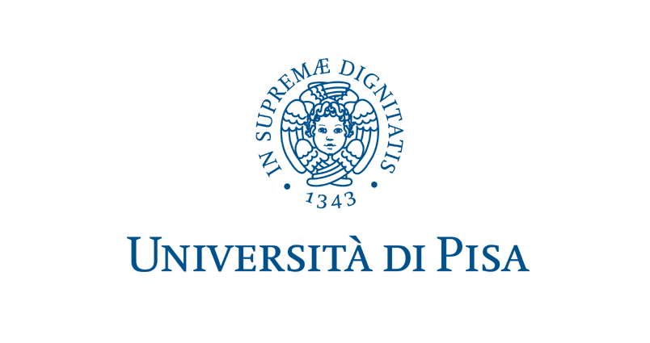

[![Contributors][contributors-shield]][contributors-url]
[![Forks][forks-shield]][forks-url]
[![Stargazers][stars-shield]][stars-url]
[![Issues][issues-shield]][issues-url]
[![LinkedIn][linkedin-shield]][linkedin-url]

 

  

  <h3 align="center">Master Degree (ICTSA)</h3>

  

    This repository will contain links to redirect you to specific exams that I've taken during my Master Degree in Computer Science (Pisa), curriculum <a href="https://didattica.di.unipi.it/laurea-magistrale-in-informatica/curricula/curriculum-ict-solutions-architect/">ICT Solutions Architect</a> (2019-2021). I hope this will help someone :)
     
	<a href="https://gpurgatorio.github.io/Master-Computer-Science-ICT/">Main</a>
	·
    <a href="https://github.com/GPurgatorio/Master-Computer-Science-ICT/issues">Report Bug</a>
  

  
<h2 style="display: inline-block">Table of Contents</h2>

  <ol>
    <li><a href="#exams">Exams</a></li>
	<ul>
        <li><a href="#ase">Advanced Software Engineering</a></li>
		<li><a href="#ap">Advanced Programming</a></li>
		<li><a href="#ae">Algorithm Engineering</a></li>
		<li><a href="#dm">Data Mining</a></li>
		<li><a href="#spm">Distributed systems: paradigms and models</a></li>
		<li><a href="#ict-i">ICT Infrastructures</a></li>
		<li><a href="#ict-ra">ICT Risk Assessment</a></li>
		<li><a href="#ml">Machine Learning</a></li>
		<li><a href="#mcps">Mobile and cyber-physical systems</a></li>
		<li><a href="#p2p-bc">Peer to peer systems and Blockchains</a></li>
		<li><a href="#sldv">Scientific and Large Data Visualization</a></li>
		<li><a href="#smv">Security Methods and Verification</a></li>
    </ul>
    <li><a href="#license">License</a></li>
    <li><a href="#contact">Contact</a></li>
  </ol>

## Exams

_"Computer science is no more about computers than astronomy is about telescopes."_

### ASE

[Python, HTML, Prolog]

[Advanced Software Engineering's repository](https://github.com/GPurgatorio/md-advanced-software-engineering)

We (group of 6 people) had to build a social network Facebook-like where users could post a story that has some specific randomized tags in it: first it was a monolithical web service, then we proceeded by splitting it into microservices that communicated with one another to achieve all advantages that a microservice-approach would give.

All the development followed a TDD, trying to cover the highest percentage of code coverage.

### AP

[Java, Haskell, Python]

[Advanced Programming's repository](https://github.com/GPurgatorio/md-advanced-programming)

The program focuses heavily on understanding what happens under the hood of using specific programming languages: we studied extensively an object-oriented one, a functional one and a scripting one.

### AE

[Algorithm Engineering's repository](https://github.com/GPurgatorio/md-algorithm-engineering)

The most theoretical and mathematical course out of all others. There are a lot of topics that are all summarized in the two pdfs files available (they're hand-written!). 

I literally can't tell in a short way which topics were taken into account during the course, because they touch so many different fields that I wouldn't know where to start. Maybe the only way to put it is "being efficient doing everything", from reducing the number of I/Os, to specific efficient data structures for searching/ordering/etc (e.g. bloom filters, (Patricia) Tries, Skip Lists), to exploit informations hidden in data to either speed up computations or encode data while occupying less memory.. And so on. 

### DM

[Python] 

[Data Mining's repository](https://github.com/jacopo-massa/dm-project)

The exam relies on exploiting some data mining tools to clean data from outliers, highlighting specific and relevant features in a datasets, analyze clusters (e.g. K-means), use some machine learning techniques to predict unknown labels (e.g. SVM, KNN, Random Forests, ...) and finally find some sequential pattern mining. 

We (2 people) also added an additional task, being our project's dataset an Excel file of a supermarket's transactions, to also find association rules and frequent patterns (Apriori algorithm).

### SPM

[C++]

[Distributed systems: paradigms and models's repository](https://github.com/GPurgatorio/md-parallel-and-distributed-systems)

The course's main focus is "Algorithmic Skeletons", but also Parallel Design Patterns. To put it simple, it's just using efficient pre-defined building blocks to parallellize sequential application in order to achieve some kind of speedup (depending on the type of task, stream or data parallel). 

Then a project had to be submitted and, in my case, a K-NN implementation (C++) was requested. Specifically I had to implement it twice: once using the standard library (so POSIX threads) and once using the FastFlow library.

### ICT I

[ICT Infrastructures's repository](https://github.com/md-cs-student-unipi/ICT-Infrastructures)

Also this course touches many topics, maybe too many to summarize them here. From how air cooling works in data center to cloud architectures, it's better for you to read the awesome work other students made already.

### ICT RA

[ICT Risk Assessment's repository](https://github.com/GPurgatorio/md-ict-risk-assessment)

This course is about security and so much more. Risk Assessment is about identifying potential future events that may have an impact, and how much you (your architecture/system) may tolerate these events. Due to this, it's not just something to become a pentester, but it goes way deeper. 

The exam is either a presentation or an analysis on security tools: I've decided to choose the first one, and I presented a paper on blockchains and IoT.

### ML

[Python]

[Machine Learning's repository](https://github.com/jacopo-massa/ml-project)

Pretty much the same exam as the 6 CfU one from the previous degree, it just goes deeper in how some things work.

The project (Python) was either of type A (implement everything yourself) or type B (compare different tools and models to solve a regression task). We (2 people) compared for Neural Networks Keras and PyTorch: to also see different results on different models, we used Support Vector Machines aswell from scikit-learn.

For both models we used a validation schema consisting into an exhaustive grid search and K-Fold-Cross-Validation technique for model selection and hyperparameters' tuning.

### MCPS

[Python (not mandatory)]

[Mobile and cyber-physical systems's repository](https://github.com/GPurgatorio/md-mobile-and-cyber-physical-systems)

The project that you'll find under the name _BlueFace_ is an implementation of access control in specific rooms. To put it simple, imagine a camera at the front door of a building: this camera will check for employees' faces and, by face recognition, open their relative door that was locked. It also support multifactor authentication (e.g. Bluetooth) in order to not automatically lock the door once the employee leaves its own office and is in range.

The exam is about cyber-physical systems in general, and therefore you may see how technologies like 3G (or 5G, why not) work, the IoT world, bluetooth, wi-fi, how antennas work, and so on.

### P2P BC

[Java, Solidity]

[Peer to peer systems and Blockchains's repository](https://github.com/GPurgatorio/md-peer-to-peer-systems-and-blockchains)

The course is divided in two parts (therefore the name): there were two midterms, one about monitoring the IPFS network (P2P), and one about Bitcoin, Ethereum and Complex Network Analysis (Blockchains).

After these, a final project modelling the expansion of a virtual virus in a simulated environment had to be done (decision likely biased due to the Covid pandemic, but interesting nonetheless!).

### SLDV

[HTML, CSS, Javascript]

[Scientific and Large Data Visualization's repository](https://github.com/GPurgatorio/md-scientific-and-large-data-visualization)

Also this course is divided in two parts: the first part is about 3D modelling, meshes, data structures and so on, while the second is about data visualization (channels, infographics, etc). The final project could have been one of the two choices and I've chosen the latter. A site (HTML + CSS + Javascript) that is currently being hosted on Github Pages, with the main topic of women's refuges in Italy and their relative funds, region by region (y. 2016-2018). 

### SMV

[Security Methods and Verification's repository](https://github.com/GPurgatorio/md-security-methods-and-verification)

This course is about Formal Methods: memory safety, type safety, information flow, Pi Calculus, Control Flow Analysis and so on.

The exam consists in presenting a paper on these arguments and I've chosen as the main topic "Gradual Release" to model what an attacker may know at some time during the execution flow. Basically, it's security but when speaking about mathematically provable concepts (therefore, formal).

## License

Most of the code is distributed under the GNU General Public License v3.0 License. See `LICENSE` on each repository for more information.

## Contact

[Giulio Purgatorio](https://gpurgatorio.github.io/)

[contributors-shield]: https://img.shields.io/github/contributors/GPurgatorio/Master-Computer-Science-ICT.svg?style=for-the-badge
[contributors-url]: https://github.com/GPurgatorio/Master-Computer-Science-ICT/graphs/contributors
[forks-shield]: https://img.shields.io/github/forks/GPurgatorio/Master-Computer-Science-ICT.svg?style=for-the-badge
[forks-url]: https://github.com/GPurgatorio/Master-Computer-Science-ICT/network/members
[stars-shield]: https://img.shields.io/github/stars/GPurgatorio/Master-Computer-Science-ICT.svg?style=for-the-badge
[stars-url]: https://github.com/GPurgatorio/Master-Computer-Science-ICT/stargazers
[issues-shield]: https://img.shields.io/github/issues/GPurgatorio/Master-Computer-Science-ICT.svg?style=for-the-badge
[issues-url]: https://github.com/GPurgatorio/Master-Computer-Science-ICT/issues
[linkedin-shield]: https://img.shields.io/badge/-LinkedIn-black.svg?style=for-the-badge&logo=linkedin&colorB=555
[linkedin-url]: https://linkedin.com/in/GPurgatorio
