ICT Infrastructures - University of Pisa (Italy)

*Since there is no material on ICT Infrastructures course, I'm trying to recap all lessons done in this page. The notes are written trying to remember the contents of the course (in accordance with the OneNote Notebook published on course page) and then expanding that contents with structured resources found online. If you find any error please, fork and submit a pull request!*

# Table of contents
<!-- AUTO-GENERATED-CONTENT:START (TOC:collapse=true&collapseText=Click to expand) -->

Click to expand

- [Introduction](#introduction)
- [Cloud Computing Reference Model](#cloud-computing-reference-model)
  * [Virtual Layer](#virtual-layer)
  * [Control Layer](#control-layer)
  * [Service Layer](#service-layer)
  * [Service Managment](#service-managment)
  * [Business Continuity](#business-continuity)
- [Datacenters](#datacenters)
- [Design and Architectures](#design-and-architectures)
- [Cooling](#cooling)
    + [CRAC: Computer Room Air Conditioner](#crac-computer-room-air-conditioner)
    + [Hot aisle datacenter](#hot-aisle-datacenter)
    + [In-Row cooling](#in-row-cooling)
  * [Liquid cooling](#liquid-cooling)
- [Current](#current)
  * [Power Distribution](#power-distribution)
  * [PUE: Power Usage Effectiveness](#pue-power-usage-effectiveness)
- [Fabric](#fabric)
    + [Ethernet](#ethernet)
    + [Infiniband](#infiniband)
    + [Omni-Path](#omni-path)
      - [RDMA: Remote Direct Memory Access](#rdma-remote-direct-memory-access)
  * [Some consideration about numbers](#some-consideration-about-numbers)
    + [Real use case](#real-use-case)
  * [Connectors & plugs](#connectors--plugs)
  * [Software Defined *** and Open Newtwork](#software-defined--and-open-newtwork)
    + [Open Flow](#open-flow)
    + [SDN: Software Defined Networking](#sdn-software-defined-networking)
    + [Software-defined data center](#software-defined-data-center)
  * [Hyperconvergence](#hyperconvergence)
- [Network topologies](#network-topologies)
    + [Spanning Tree Protocol (STP)](#spanning-tree-protocol-stp)
    + [Three-tier design](#three-tier-design)
    + [Network Chassis](#network-chassis)
    + [Stacking](#stacking)
    + [Spine and leaf Architecture](#spine-and-leaf-architecture)
    + [Full Fat Tree](#full-fat-tree)
  * [VLAN](#vlan)
  * [Switch Anatomy](#switch-anatomy)
- [Disks and Storage](#disks-and-storage)
- [Interfaces](#interfaces)
- [Redundancy](#redundancy)
- [IOPS](#iops)
- [Functional programming](#functional-programming)
- [Memory Hierarchy](#memory-hierarchy)
  * [NVMe](#nvme)
  * [Storage aggregation](#storage-aggregation)
- [Network Area Storage (NAS)](#network-area-storage-nas)
- [Storage Area Network (SAN)](#storage-area-network-san)
  * [Benefits](#benefits)
- [HCI - Hyperconvergent Systems](#hci---hyperconvergent-systems)
- [SDS - Software Defined Storage](#sds---software-defined-storage)
- [Non-RAID drive architectures](#non-raid-drive-architectures)
- [Some consideration about Flash Drives](#some-consideration-about-flash-drives)
- [Storage in the feature](#storage-in-the-feature)
- [Hypervisors](#hypervisors)
- [Servers](#servers)
- [Form-factors](#form-factors)
    + [Miscellaneous](#miscellaneous)
- [Cloud](#cloud)
  * [Rapid Elasticity](#rapid-elasticity)
  * [High Avaialability](#high-avaialability)
- [Cloud computering Layer](#cloud-computering-layer)
    + [Phyisical Layer](#phyisical-layer)
- [Virtual Layer](#virtual-layer-1)
    + [About the virtual memory:](#about-the-virtual-memory)
      - [Balooning](#balooning)
    + [Other considerations about the Virtual Layer](#other-considerations-about-the-virtual-layer)
      - [vMotion - Live Migration](#vmotion----live-migration)
    + [Docker](#docker)
- [Control Layer](#control-layer-1)
  * [Service orchestration Layer](#service-orchestration-layer)
- [Business Continuity](#business-continuity-1)
    + [Backups](#backups)
  * [Security](#security)
    + [Firwall](#firwall)
  * [Service Managment](#service-managment-1)
- [GDPR General Data Protection Regulation](#gdpr-general-data-protection-regulation)
- [Vendor Lock-in](#vendor-lock-in)
  * [Standardization-Portability](#standardization-portability)
- [Orchestration](#orchestration)
- [Fog Computing](#fog-computing)
- [Miscellaneous](#miscellaneous-1)
  * [Redundancy](#redundancy-1)
- [In class exercises](#in-class-exercises)
- [1 - Discuss the difference between spine and leaf fabric and the more traditional fabric architecture based on larger chassis. How bandwidth and latency are affected?](#1---discuss-the-difference-between-spine-and-leaf-fabric-and-the-more-traditional-fabric-architecture-based-on-larger-chassis-how-bandwidth-and-latency-are-affected)
- [Spine and Leaf](#spine-and-leaf)
- [Traditional Chassis](#traditional-chassis)
- [2 - What actions can take the orchestration layer of a cloud system, and based on what information, in order to decide how many web server istances should be used to serve a Web system?](#2---what-actions-can-take-the-orchestration-layer-of-a-cloud-system-and-based-on-what-information-in-order-to-decide-how-many-web-server-istances-should-be-used-to-serve-a-web-system)
- [3 - Discuss a datacenter architecture made of 10 racks. Assuming a power distribution of 15 W/ rack.](#3---discuss-a-datacenter-architecture-made-of-10-racks-assuming-a-power-distribution-of-15-w-rack)
- [4 - A service requires a sustained throughput towards the storage of 15 GB/s. Would you recomment using a SAN architecture or an hyperconvergent one.](#4---a-service-requires-a-sustained-throughput-towards-the-storage-of-15-gbs-would-you-recomment-using-a-san-architecture-or-an-hyperconvergent-one)
  * [SAN area network (recap)](#san-area-network-recap)
  * [NAS](#nas)
  * [HCI (hyperconvergent)](#hci-hyperconvergent)
    + [Discussion](#discussion)
- [What should I look for..](#what-should-i-look-for)
- [5 - A service requires a sustained throughput towards the storage of 15 GB/s. How would you dimension an hyperconvergent system to ensure it works properly?](#5---a-service-requires-a-sustained-throughput-towards-the-storage-of-15-gbs-how-would-you-dimension-an-hyperconvergent-system-to-ensure-it-works-properly)
- [References](#references)

<!-- AUTO-GENERATED-CONTENT:END -->

# Introduction
The world is changing and a lot of axiom are becoming false. Some example? In the bachelor course (and not, sigh), the teachers say: "The main bottleneck is the disk", and so all the performance are evalueted with reference to disk usage, number of IOs operations and so on... This, nowadays, is false.  Just thing of [Intel Optane SSD](https://www.anandtech.com/show/11702/intel-introduces-new-ruler-ssd-for-servers) where the new SSD tecnologie based on 3D NAND permits to write and read more fast then previous SSD (the disk that we have installed on our system, sigh number 2), and so we have to redesign the system. There is also **nvRAM**, non volatile RAM : a module similar to the hard drive but really fast. Some distributed file system, written in '90s, are crashing due the axiom that the disks are slower than CPU and so you have enough time to do all the computation needed. False! 

Another example is in application and server distribution. In the past many application was managed on each server with a shared storage, nowadays we have deploy a large application on a clusters of server with local storage, so new system to develop and manage distributed computing application is needed (Hadoop, cassandra (distributed DB), Spark (Computation)...).

The world is evolving faster than I can write this notes, so maybe some things written here are already obsolete, so we can not waste any more time on introduction to avoid to need to rewrite the introduction. 

Let's start to see how a datacenter is build to support new requests. 

# Cloud Computing Reference Model
Just a brief overview on the reference model of cloud computing.

  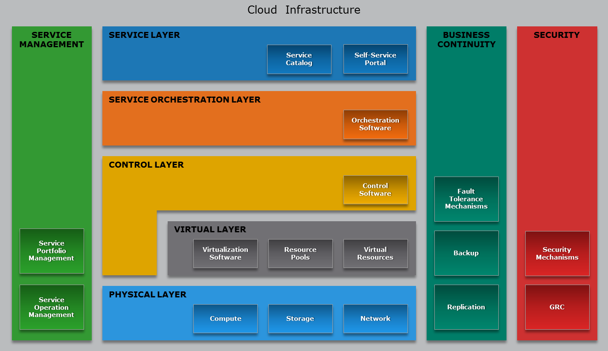

### Virtual Layer
The physical server is partitioned in many virtual ones to use the hardware better.  
**High Parformance Computing** bypasses the virtual layer for performance reasons.

### Control Layer
Dynamic allocation rather than static.

### Service Layer
Kind of self service. Use the resource you need without knowing where they are allocated.

### Service Managment
Upgrading the software or the firmware while the system is running.

### Business Continuity
**Backups** vs **Replicas**: doing a backup of 1 PB may be a problem.  
**Fault Tolerance**: I should be able to power off a server without anyone noticing it.

# Datacenters

A data center is a facility used to house computer systems and associated components, such as telecommunications and storage systems. It generally includes redundant or backup components and infrastructure for power supply, data communications connections, environmental controls (e.g. air conditioning, fire suppression) and various security devices. A large data center is an industrial-scale operation using as much electricity as a small town.

On average there are only 6 person managing 1 million servers.
Prefabricated group of racks, already cabled and cooled, are automatically inserted in the datacenter (POD Point Of Delivery). If something is not working in the prefabricated, the specific server is shutted down. If more than the 70% is not working the POD producer will simply change the entire unity.

The datacenter is a place where we concentrate IT system in order to reduce costs. Servers are demanding in terms of current, cooling and security. 

## Design and Architectures

## Cooling

Today cooling is air based. Just the beginning for liquid cooling.  
The air pushed throught the server gets a 10/15 degrees temperature augment.
#### CRAC: Computer Room Air Conditioner

Popular in the '90 (3-5KW/rack), but not very efficient in terms of energy consumption.  
There is a **floating floor**, all the cabling and the cooling is done under the floor. The air goes up because of termal convection.

  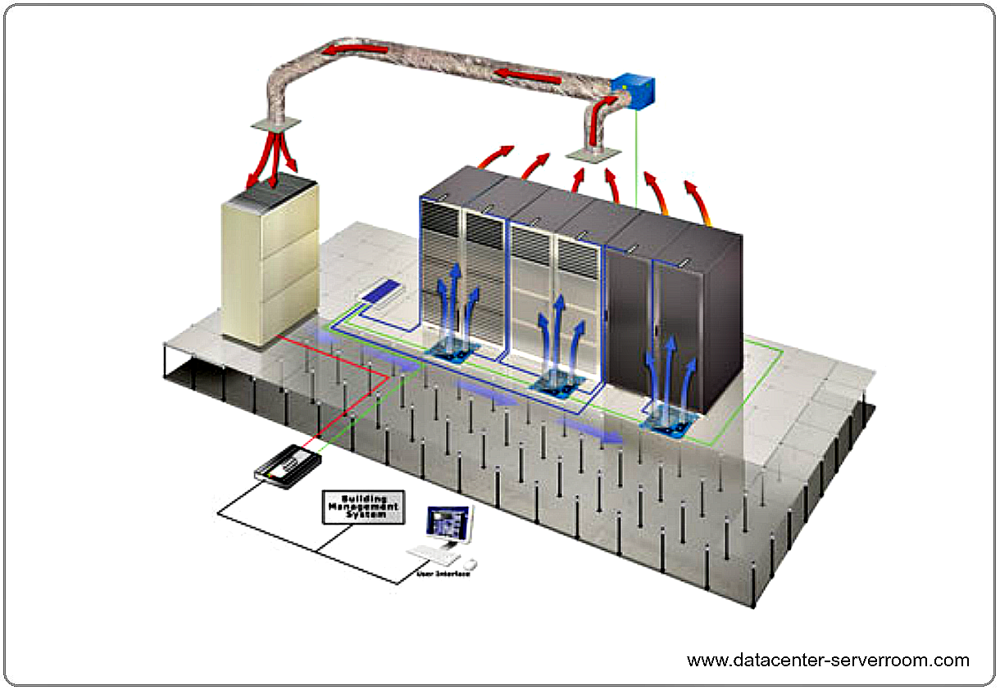

Drawbacks are density (if we want to go dense this approach fails) and the absence of locality.
Noone is doing this today.

#### Hot aisle datacenter

  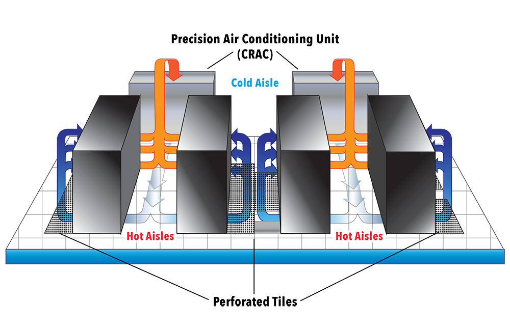

Hot and cold corridors. 
The **workload balacing** may be a problem: there can be the situation where a rack is hotter than the other depending on the workload. Difficult to module the ammount of hot and cold air. In CRAC model the solution is pumping for the higher consumer, 

#### In-Row cooling

In-row cooling technology is a type of air conditioning system commonly used in data centers in which the cooling unit is placed between the server cabinets in a row for offering cool air to the server equipment more effectively.

In-row cooling systems use a horizontal airflow pattern utilizing hot aisle/cold aisle configurations and they only occupy one-half rack of row space without any additional side clearance space. Typically, each unit is about 12 inches wide by 42 inches deep.

These units may be a supplement to raised-floor cooling (creating a plenum to distribute conditioned air) or may be the primary cooling source on a slab floor.

  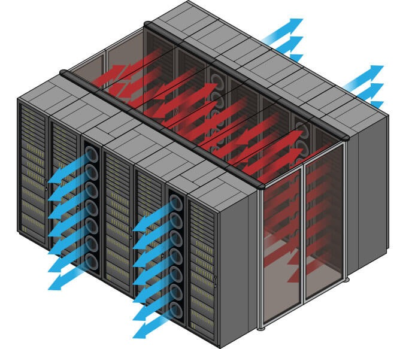

The in-row cooling unit draws warm exhaust air directly from the hot aisle, cools it and distributes it to the cold aisle. This ensures that inlet temperatures are steady for precise operation. Coupling the air conditioning with the heat source produces an efficient direct return air path; this is called “close coupled cooling,” which also lowers the fan energy required. In-row cooling also prevents the mixing of hot and cold air, thus increasing efficiency.

It's possible to give more cooling to a single rack, moduling the air needed. In front of the rack thare are temperature and humidity sensors (humidity should be avoided because can conduct electricity).
There are systems collecting data from the sensors and adjusting the fans. The racks are covered to separate cool air and hot air. It's also possible to optimize the datacenter cooling according to the temperature changes of the region where the datacenter is.

Generally 2 racks (each 70 cm), 1 colling row (30 cm), 2 racks, 1 row ..

### Liquid cooling
Having water in a DC is a risky business (even if there are different ways to handle a fire). Make the water flow ont thre CPUs lowers the temperature for ~40%. One way of chilling the water could be pushing it down to the ground. Water Distribution System, like the Power Distribution System.

## Current
A 32 KW (consume of 10 appartments) datacenter is small.  
**Direct Current Transformers** from AC to DC. Direct current is distributed inside the datacenter even if is more dangerous than Alternating current.

Watt = cos fi * V * A  
**cos fi** gives the efficency of the power supply and generally it changes according to the ammount of current needed (idle vs under pressure).

For example an idle server with 2 CPUs (14 cores each) consumes 140 Watts.

### Power Distribution
The Industrial current il 380 Volts, 3 phases.  
The ammount of current allowed in a DC are the Ampere on the **PDU** (Power Distribution Unit)

There are one or more lines (for reliability and fault tolerance reasond) coming from different generators to the datacenter (i.e. each line 80 KW , 200 A more or less. Can use it for 6 racks 32A/ rack. Maybe I will not use the whole 32 A so I can put more racks).  
The lines are attached to an **UPS Uninterruptible Power Supply/Source**. It is a rack or half a rack with batteries (not enought to keep on the servers) that in some cases can power the DC for ~20 minutes. There are a **Control Panel** and a **Generator**. When the power lines fail the UPS is active between their failure and the starting of the generator.  The energy that arrives to the UPS should be divided among the servers and the switches.
The UPS is attached to the **PDU** (Power Distribution Unit) which is linked to the **server PDU** with a pair of lines for redundancy. In the server there are the power plugs in a row that can monitored via a web server running on the rack PDU. Example of rack PDU: 2 banks, 12 plugs each, 16 A each bank, 15 KW per rack, 42 servers per rack.

### PUE: Power Usage Effectiveness

PUE is a ratio that describes how efficiently a computer data center uses energy; specifically, how much energy is used by the computing equipment (in contrast to cooling and other overhead).

PUE is the ratio of total amount of energy used by a computer data center facility  to the energy delivered to computing equipment. PUE is the inverse of data center infrastructure efficiency (DCIE).

As example, consider that the PUE of the university's datacenter during 2018 is less 1.2, while the average italian datacenter's PUE are around 2-2.5.
If the PUE is equal to 2 means that for each Watt used for computing, 2 Watts are used for cooling.
The ratio is Total Current divided by Compute Current.

# Fabric
The fabric is the interconnection between nodes inside a datacenter. We can think this level as a bunch of switch and wires. 

We refer to North-South traffic indicating the traffic outgoing and incoming to the datacenter (internet), while we refer to East-West as the internal traffic between servers.

#### Ethernet
The connection can be performed with various technologies, the most famous is **Ethernet**, commonly used in Local Area Networks (LAN) and Wide Area Networks (WAN). Ethernet use twisted pair and fiber optic links. Ethernet as some famous features such as 48-bit MAC address and Ethernet frame format that influenced other networking protocols. 

**MTU** (Maximum Transfer Unit) up to 9 KB with the so called **Jumbo Frames**.
On top of ethernet there are TCP/IP protocols (this is a standard), they introduce about 70-100 micro sec of latency.

#### Infiniband
Even if Ethernet is so famous, there are other standard to communicate. **InfiniBand (IB)** is another standard used in high-performance computing (HPC) that features very high throughtput and very low latency (about 2 microseconds). InfiniBand is a protocol and a physical infrastructure and it can send up to 2GB massages with 16 priorities level.
The [RFC 4391](https://tools.ietf.org/html/rfc4391) specifies a method for encapsulating and transmitting IPv4/IPv6 and Address Resolution Protocol (ARP) packets over InfiniBand (IB).

InfiniBand trasmits data in packets up to 4KB. A massage can be:
 - a direct memory access read from or write to a remote node (**RDMA**)
 - a channel send or receive
 - a transaction-based operation (that can be reversed)
 - a multicast trasmission
 - an atomic operation

Pros:
 - no retransmission
 - QoS, trafic preserved, reliable

#### Omni-Path
Moreover, another communication architecture that exist and is interested to see is Omni-Path. This architecture is owned by Intel and performs high-performance communication. Production of Omni-Path products started in 2015 and a mass delivery of these products started in the first quarted of 2016 (you can insert here some more stuff written on [Wikipedia](https://en.wikipedia.org/wiki/Omni-Path)). 
The interest of this architecture is that Intel plans to develop technologiy based on that will serve as the on-ramp to exascale computing (a computing system capacle of the least one exaFLOPS). 

##### RDMA: Remote Direct Memory Access
If you read wikipedia pages about IB and OmniPath you will find a acronym: RDMA. This acronym means Remote Direct Memory Access, a direct memory access (really!) from one computer into that of another without involving either one's OS, this permits high-throuhput, low-latency networking performing.

RDMA supports zero-copy networking by enabling the network adapter to transfer data directly to or from application memory, eliminating the need to copy data between application memory and the data buffers in the operating system. Such transfers require no work to be done by CPUs, caches, or context switches, and transfers continue in parallel with other system operations. When an application performs an RDMA Read or Write request, the application data is delivered directly to the network, reducing latency and enabling fast message transfer.

### Some consideration about numbers
Start think about real world. We have some server with 1 Gbps (not so high speed, just think that is the speed you can reach with your laptop attaching a cable that is in classroom in the univesity). We have to connects this servers to each other, using a switches (each of them has 48 ports). We have a lots of servers... The computation is done.

  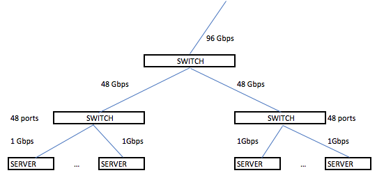

#### Real use case
As we see we need a lots of bandwith to manage a lots of service (you don't say?) and even if the north-south traffic (the traffic that goes outsite from our datacenter) can be relatively small (the university connection exits on the world with 40 Gbps), the east-west traffic (the traffic inside the datacenter) can reach a very huge number of Gbps. [Aruba datacenter](https://www.arubacloud.com/infrastructures/italy-dc-it1.aspx) (called IT1) with another Aruba datacenter (IT2) reach a bandwidth of 82 Gbps of Internet connection.

Yesterday I went to master degree thesis discussion of my friend. He is a physicist and his experiment requires 2.2Tbps of bandwidth to store produced data, so public cloud is impossible to use. How can manage 2.2 Tbps? Maybe we can reply to this answer (hopefully, otherwise the exam is failed :/ ).

### Connectors & plugs
Now we try to analyse the problem from the connector point of view. The fastest wire technology avaiable is the optic fiber. It can be divided into two categories: monomodal (1250 nm) or multimodal (850 nm). The monomodal fiber is more expensive but has better properties, the multimodal one is acceptable for a datacenter. They also have different transceiver. There are two kind of connectors LC, ok for datacenters, and SC, usually used in metropolitan areas because it has a better signal propagation (there can be a cable with a LC in one side and a SC on the other side).  

 Of course, a wire is a wire, and we need something to connect it to somewhere. One of them is the Small form-factor pluggable transceiver (SFP), a compact, hot-pluggable optical module transceiver. The upgrade of this connector is the SFP+ that supports data rates up to 16 Gbps. It supports 10 Gigabit ethernet and can be combined with some other SFP+ with QSFP to reach 4x10Gbps. If combined with QSFP28 we can reach 100 Gbps on the ethernet that is the upper limit nowadays for the data rate.

From letf to right: RJ45 plug, SFP+ and QSFP+ **transceiver module**, LC connector. 

  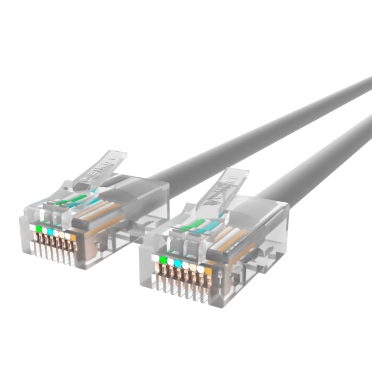
  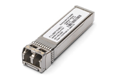
  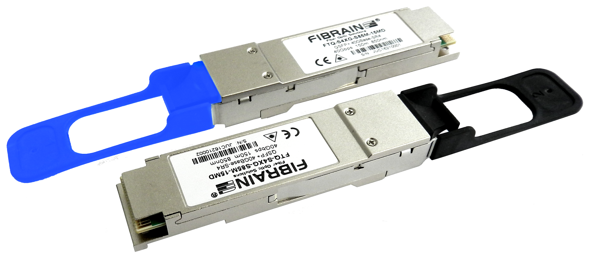
  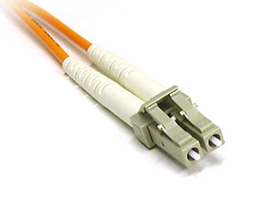

**RJ45** plug supports 10/100 Mbps, 1/2.5/5 Gbps but in datacenters there are almost no installations of it.  
Cables have categories: 
- cat4
- cat5  
- cat6  

2.5/5 Gbps are new standards working on cat5 and cat6 cables respectively, in order to deliver more bandwidth to the wifi access point.  
16 Gbps uses **SFP+** plug (SFP28, where 28 is number of pins).  
40 Gbps (4 lines 10 Gbps each) uses **QSFP+** (QSFP28).

Nowadays we have:
- 25 Gbps 
- 50 Gbps (2 * 25)
- 100 Gbps (4 * 25)

The **Transceiver module** can serve copper or optical fiber; it has a chip inside and is not cheap.

### Software Defined *** and Open Newtwork

The Software Defined something, where something is Networking (**SDN**) or Storage (**SDS**), is a novel approach to cloud computing. 

#### Open Flow

[OpenFlow](https://en.wikipedia.org/wiki/OpenFlow) is a communications protocol that gives access to the forwarding plane of a network switch or router over the network.
The switch, once approved the initial connection with a firewall, redirect the allowed traffic to anther port, bypassing the firewall since it is not able to handle the entire data flow bandwidth ([Open daylight](https://www.opendaylight.org/)).

- copy/redirect/ close the flow to optimize and control the behaviour of the network.

#### SDN: Software Defined Networking
SDN is an architecture purposing to be dynamic, manageable, cost-effective and some more nice attribute readable [here](https://en.wikipedia.org/wiki/Software-defined_networking#Concept). This type of software create a virtual network to manage the network with more simplicity.

The main concept are the following:
 - Network control is directly programmable (also from remote)
 - The infrastructure is agile, since it can be dynamically adjustable
 - It is programmatically configured and is managed by a software-based SDN controller
 - It is Open Standard-based and Vendor-neutral

Thee is a **flow table** in the switches that remembers the connection. The routing policies are adopted according to this table.  
Deep pkt instection made by a level 7 firewall. The firewalll validates the flow and if it's aware that the flow needs bandwidth, the firewall allows it to bypass the redirection (of the firewall).

#### Software-defined data center
Software-defined data center is a sort of upgrade of the previous term and indicate a series of virtualization concepts such as abstraction, pooling and automation to all data center resources and services to achieve IT as a service.

### Hyperconvergence
So we virtualize the networking, the storage, the data center... and the cloud! Some tools, as [Nutanix](https://www.nutanix.com/hyperconverged-infrastructure/) build the [hyperconverged infrastructure HCI](https://en.wikipedia.org/wiki/Hyper-converged_infrastructure) technology.

## Network topologies

A way of cabling allowing multiple computers to comunicate. It's not necessary a graph, but for the reliability purpose it often realized as a set of connected  nodes. At least 10% of nodes should be connected in order to guarantee a sufficient reliability ([Small World Theory](https://en.wikipedia.org/wiki/Small-world_network)).

 At layer 2 there is no routing table, even if there are some cache mechanism. The topology is more like a tree than a graph because some edges can be cutted preserving reachability and lowering the costs.

#### Spanning Tree Protocol (STP) 

The spanning Tree Protocol is a network protocol that builds a logical loop-free topology for Ethernet networks. The spanning tree is built using some Bridge Protocol Data Units (BPDUs) frames. In 2001 the IEEE introduced Rapid Spanning Tree Protocol (RSTP) that provides significantly faster spanning tree convergence after a topology change.

Now days this protocol is used only in campus and not in datacenters, due to its hight latency of convergence (up to 10-15 seconds to activate a backup line).

#### Three-tier design

This architecture is simple architecture where each component has a redundant unit to replace it in case of failure.

#### Network Chassis
The Network Chassis is a sort of big  modular and resilient switch. At the bottom it has a pair of power plugs and then it's made of modular **line cards** (with some kind of ports) and a pair of **RPM** Routing Processing Modules to ensure that the line cards work. The chassis can be over provisioned to resist to aging but it has a limit.  
Pros
- resilient
- 1 CLI per switch
- expandible  

Cons
- exepensive
- not entirely future proof (today some switches may need up to 1KW power supply, while years ago they needed only 200 W)
- aging problem

The chassis is connected with the rack's **tor** and **bor** (top/bottom of rack) switches via a double link. 

 #### Stacking
 Indipendent switches stacked with dedicated links. It's cheaper than the chassis but there is less redundancy.

#### Spine and leaf Architecture

  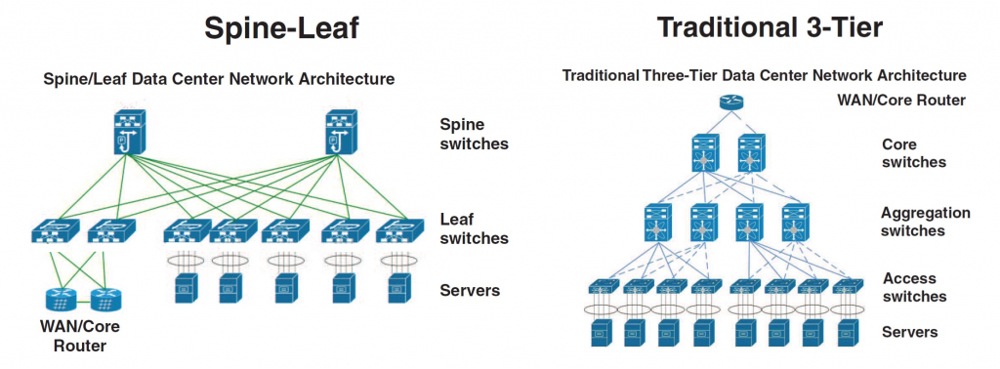

With the increased focus on east-west data transfer the three-tier design architecture is being replaced with Spine-Leaf design. The switches are diveded into 2 groups, the leaf switches and spine switches. Every leaf switch in a leaf-spine architecture connects to every switch in the network fabric. 
In that topoligy the **Link Aggregation Control Protocol (LACP) is used**. It provides a method to control the bundling of several physical ports together to form a single logical channel. The bandwidth is aggregated (i.e. 2*25 Gbps), but it's still capped to 25 Gbps because the traffic goes only from one way to the other each time. 

- fixed form factor (non modular switches)
- active-active redundancy
- loop aware topology (no links disabled).
- interconnect using standard cables (decide how many links use to interconnect spines with leaves and how many others link to racks).

With this architecture it's possible to turn off one switch, upgrade it and rebbot it without compromising the network.

A tipicall configuration of the ports and bandwidth of the leaves is:
- one third going upwards and two thirds going downwards
- 48 ports 10 Gbps each , 6 ports 40 Gbps each
- or 48 ports 25 each, 6 ports 100 each

Just a small remark: with spine and leaf we introduce more hops, so more latency, than the chassis approach.

#### Full Fat Tree

In this network topology, the link that are nearer the top of the hierarchy are "fatter" (thicker) than the link further down the hierarchy. Used only in high performance computing where performances have priority over budgets.

The full fat tree resolves the problem of over-subscription. Adopting the spine and leaf there is the risk that the links closer to the spines can't sustain the traffic coming from all the links going from the servers to the leaves. The full fat tree is a way to build a tree so that the capacity is never less than the incoming trafic. It's quite expensive and because of this reason some over suscription can be accepted.

  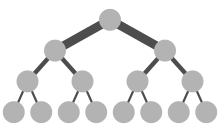

### VLAN
Now, the problem is that every switch can be connected to each other and so there is no more LANs separation in the datacenter, every packet can go wherever it wants and some problems may appear. For this problem the VLAN is invented. It partition a broadcast domain and create a isolated computer network.

It works by applying _tags_ to network packets (in Ethernet frame) and handling these tags in the networking systems. 

  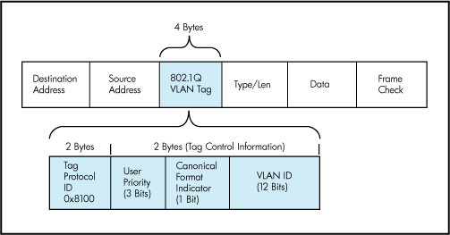

A switch can be configured to accept some tags on some ports and some other tags on some other ports. 

VLAN are useful to manage the access control to some resources (and avoid to access to some subnetwork from other subnetwork). Different VLANs for different purposes.

### Switch Anatomy
A switch is an ASIC (application-specific integrated circuit). It can be proprietary architecture or non-proprietary. Layer two switches receive pkts and implements the equivalent of a bus: store and forward (there is a special address allowing broadcast). At layer 3 there is no loop problem, as in layer 2, because of the Internet Table.

Datacenter's switches are usually non-blocking. It basically means that this switches have the forwarding capacity that supports concurrently all ports at full port capacity.

Now some standard are trying to impose a common structure to the network elements (switch included) to facilitate the creation of standard orchestration and automation tools.

The internal is made of a **control plane** which is configurable and a **data plane** where there are the ports. The control plain evolved during the years, now they run an OS and Intel CPU's. Through a CLI Command Line Interface it's possible to configure the control plaun. Some exaples of command are:
- show running config
- show interfaces status 
- show vlan
- config ( to enter in config mode)

Some protocols in the switch (bold ones are important):
- PING to test connectivity.
- LLDP Local Link Discovery Protocol ( a way to explore the graph).
- **STP** Spanning Tree Protocol (to avoid loops).
- RSTP Rapid-STP
- DCBX Data Center Bridging eXchange (QoS, priority)
- PFC Priority Flow Control
- ETS Enanched Transmission Selection (priority)
- **LACP**  Link Aggregation Control Protocol (use two wires as they are one).

**ONIE** (Open Netwoking Installed Environment) boot loader  

The switch has a firmware and two slots for the OS images. When updating in the first slot we store the old OS image, in the second slot the new one.

**NFV** Network Functions Virtualization (5G mostly NFV based)  
THe data plain is connected to a DC's VM which acts as a control plane.

# Disks and Storage
After the fabric, another fondamental component of a datacenter is the storage. The storage can be provided with various tecnologies. 
The simple one is that the disk are put inside each servers and are used as we use the disk on our laptop. Of course it is not useful fs we have a bunch of data to manage, and some networking solution can be better to use.

## Interfaces

- SATA
- SAS Serial Attached SCSI
- NVMe (Non Volatile Memory express): controller-less, protocol used over PCI express bus
- ...

## Redundancy

[RAID](https://en.wikipedia.org/wiki/RAID#Standard_levels) stands for Redundant Array of Independent Disks. The RAID is done by the disk controller or the OS.   
The more common RAID configurations are:

- RAID-0: striping, two drivers aggregated that works as a single one.
- RAID-1: mirroring,write on both the drives one is the copy of the other.
- RAID-5: block-level striping with distributed parity. It's xor based: the first bit goes in the first disk, the second bit in the second one and their xor in the third. If one disk crashes I can recompute it ( for each two bits of info I need one extra bit, so one third more disk storage).
- RAID-6: block-level striping with double distributed parity. Similar to RAID1 but with more disks.

## IOPS

Input/output operations per second is an input/output performance measurement used to characterize computer storage devices (associated with an access pattern: random or sequential).

## Functional programming

Has become so popular also because of its nature: its pure functions can easily computed in a parallel system (no storage so no necessity of locks). It's an event based programmuing: pass a function when something appens. In Object Oriented languages it's more complicated cause we have interfaces, event listeners...  

## Memory Hierarchy

- CPU Registries
- CPU Cache &nbsp;&nbsp;&nbsp;&nbsp;&nbsp;&nbsp;&nbsp;&nbsp;&nbsp; | Caching
- RAM
- nvRAM  &nbsp;&nbsp;&nbsp;&nbsp;&nbsp;&nbsp;&nbsp;&nbsp;&nbsp;&nbsp;&nbsp;&nbsp;&nbsp;&nbsp;&nbsp;&nbsp;&nbsp;| Memory tiering
- SS Memory
- Hard drive
- Tape &nbsp;&nbsp;&nbsp;&nbsp;&nbsp;&nbsp;&nbsp;&nbsp;&nbsp;&nbsp;&nbsp;&nbsp;&nbsp;&nbsp;&nbsp;&nbsp;&nbsp;&nbsp;&nbsp;&nbsp;&nbsp;| Storage tiering

As technology evolves, the harder is to maintain a model that lasts. Memory tiering a new term introduced nowadays with the Intel Sky Lake processors family (XEON). 

nvRAM uses [nvDIMM](https://en.wikipedia.org/wiki/NVDIMM) (non volatalie Dual Inline Memory Module) to save energy because you can change the ammount of current given to each pin; moreover the data doesn't need to be refreshed periodically to maintain data. 

In-memory database, like Redis. If you loose power there are still mechanisms to avoid data loss.

Processes can share memory though the memory mapping technique (the memory is seen as a file).

### NVMe

  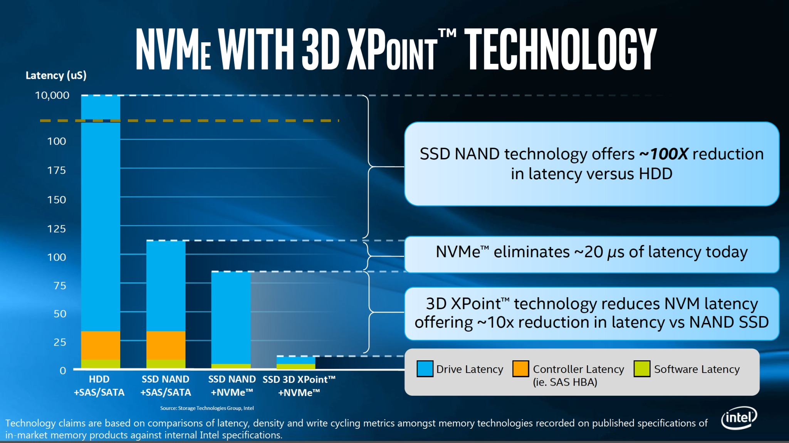

It's a protocol on the PCI express bus and it's totally controller-less. From the software side it's simpler in this way to talk with the disk because the driver is directly attached to the PCI, there is no controller and minor latency.

A bus is a component where I can attach different devices. It has a clock and some lanes (16 in PCI,  ~ 15 GB per second because each lane is slightly less then 1 GB). Four drives are enought to exhaust a full PCI III gen bus. They are also capable of saturating a 100 Gbps link.

NAND is a standard Solid State Technology.

Beside Volatile RAM it's now possible to have Persistent State RAM.

### Storage aggregation

The strategy for accessing drive makes the difference.  
Fiber channel is the kind of fabric dedicated for the storage. The link coming from the storage ends up in the Host Based Adapter in the server.

## Network Area Storage (NAS)
NAS is a file-level computer data storage server connected to a computer network providing data access to a heterogeneous group of clients. NAS systems are networked appliances which contain one or more storage drives, often arranged into logical, redundant storage containers or RAID. They typically provide access to files using network file sharing protocols such as NFS, SMB/CIFS, or AFP over a optical fiber.

When using a network file systsem protocol, you are uing a NAS.

## Storage Area Network (SAN)
While NAS provides both storage and a file system, SAN provides only block-based storage and leaves file system concerns on the "client" side. SAN protocols include Fibre Channel, iSCSI (SCSI over the fiber), ATA over Ethernet (AoE) and HyperSCSI. It can be implemented as some controllers attached to some JBoDS (Just a Bunch of Disks).  
The SAN can be divided in different LUNs Logical Units.

If the drive is seen as phisically attached to the machine, and a block transmission protocol is adopted that means that you are using a SAN. The optical fiber has become the bottleneck (just four drives to saturate a link).

With SAN the server has the impression that the LUN is attached directly to him, locally; with NAS there isn't this kind of abstraction.

Some latency can be reduced if we stripe data in a correct way and we exploit the multiple seeks.

### Benefits
The main features that are provided by a storage system are the following:
 - Thin provisioning
	- This is a virtualization technology that gives the appearance of having more physical resources than are actually avaiable. Thin provisioning allows space to be easily allocated to servers, on a just-enough and just-in-time basis. Thin provisioning is called "sparse volumes" in some contexts.
 - Deduplication
	- If the same file is required in two context, it is saved one time and is served to different context.
 - Compression
 - Authentication
 - RTO/RPO "support" DR
 	- The Recovery Point Objective is defined by business continuity planning. It is the maximum targeted period in which data might be lost from an IT service due to a major incident. 
 - Network Interface (iSCSI, Fibre Channel...)
 - RAID
 - Tiering
 	- Tiering is a technology to assign a category to data to choose various type of storage media to reduce total storage cost. Tiered storage policies place the most frequently accessed data on the highest performing storage. Rarely accessed data goes on low-performance, cheaper storage.
 - NAS Protocols
 - Snapshot

## HCI - Hyperconvergent Systems

- Nutanix: is the current leader of this technoogy
- Ceph: is a different architecture/approach
- vSAN
- SSD - Storage Spaces Direct

This kind of software is expensive (Nutanix HCI is fully software defined so you do not depend on the vendors hardware).

The main idea is not to design three different systems (compute, networking, storage) and then connect them, but it's better to have a bit of them in each server I deploy. "Adding servers adds capacity".

The software works with the cooperations of different controller (VMs) in each node (server). The controller (VM) implements the storage abstraction throught the node and it implements also the logical mooving of data. Every write keeps a copy on the local server storage exploiting the PCI bus and avoiding the network cap; a copy of the data is given to the controller of another node. The read is performed locally gaining high performances. The VM is aware that there are two copies of the data so it can exploit this fact. Once a drive fails it's copy is used to  make another copy of the data.

## SDS - Software Defined Storage
Software-defined Storage is a term for computer data storage software for policy-based provisioning and management of data storage independent of the underlying hardware. This type of software includes a storage virtualization to separate storage hardware from the software that manages it.  
It's used to build a distributed system that provides storage services.

**objec storage** (i.e. S3 by Amazon)  
Write, read, rewrite, version delete an object using HTTP.  
An object has:
- object ID
- metadata
- binary data

## Non-RAID drive architectures
Also other architectures exist and are used when RAID is too expensive or not required.
 - JBOD ("just a bunch of disks"): multiple hard disk drives operated as individual independent hard disk drives
 - SPAN: A method of combining the free space on multiple hard disk drives from "JBoD" to create a spanned volume
 - DAS (Direct-attached storage): a digital storage directly attached to the computer accessing it.

## Some consideration about Flash Drives
The bottleneck in new drives is the connector. The SATA connector is too slow to use SSD at the maximum speed. Some results can be see [here](http://www.itc.unipi.it/wp-content/uploads/2016/02/ITC-TR-01-16.pdf).

The solution? Delete the connector and attach it to PCIe. So new Specification is used, the NVMe, an open logical device interface specification for accessing non-volatile storage media attached via a PCI Express bus.

## Storage in the feature

As we can see in the image, it's been decades since the last mainstream memory update is done. In fact, the SSD became popular in the last years due the cost but they exists since 1989. 

New technology was introduced in 2015, the 3D XPoint. This improvement takes ICT world in a new phase? If yesterday our problem was the disk latency, so we design all algorithm to reduce IOs operation, now the disk is almost fast as the DRAM, as shown the following image:

With the NVMe drives we can reach 11GBps, aka 88 Gbps. Since the software latency is circa 5 microseconds, TCP/IP software introduces also a latency, 70-80 microseconds, the disk is no more a problem.

# Hypervisors
A hypervisor is a software, firmware or hardware that create and runs virtual machines. 
It can be bare-metal hypervisor or hosted hypervisor. A bare-metal is where the hypervisor is the OS itself, often requires certified hardware. Hosted hypervisor is VirtualBox.

An hypervisor permits to overbook physical resources to allocate more resources than exist.

It create also a virtual switch to distribute the networking over all VMs. 

# Servers
They are really different from desktops, the only common part is the CPU istruction set.
For istance, servers have an ECC memory with Error Correction Code built in.

Racks are divided in Units: 1 U is the minimal size you can allocate on a rack. Generraly 2 meters rack has 42 Units. 

## Form-factors

- 1U Pizza box:  
two sockets (CPU),  
~10 drives disposed orizontally.  
In the bottom part there are 2 power plugs, networking plugs for KVM (configuration console) and a **BMC** (Base Management Console) which is a stand alone OS talking with the motherboard used for remote monitoring, shut down ...  
The drives are in the front (up) part, immediatly above them there are the fans and the disk controller. Tipically the max number of CPUs is four and they are closed to the memory modules.

  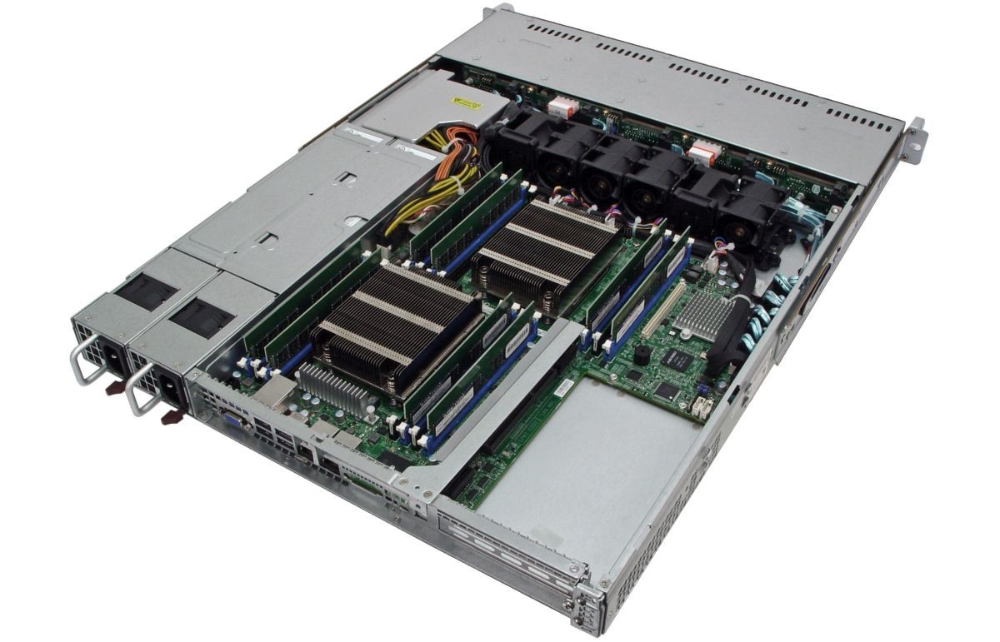

- 2U: 2 CPUs, 24 drives disposed vertically.
- 2U Twin square: 24 drives on the front disposed vertically, 4 servers 2 CPUs each, they share only the power.
- 10U Blade server: big chassis, up to 16 servers 2 CPUs each, simpler cabling, easy management and cost reduced. 
- Intel Ruler up to 1 petabyte but there is no room for CPU because it is a SS media. Possible to design a one half PB ruler with room for CPUs.

Differs from desktop systems. 
- CPU architecture with a new generation memory called [NUMA](https://en.wikipedia.org/wiki/Non-uniform_memory_access).
- [Hyper threading](https://en.wikipedia.org/wiki/Hyper-threading)
- https://en.wikipedia.org/wiki/Intel_UltraPath_Interconnect
- Intra socket connection 
- Intel [AVX](https://en.wikipedia.org/wiki/Advanced_Vector_Extensions) CPU architecture
- MCDRAM (multi channel RAM) with less latency

#### Miscellaneous
Trade-off in CPU design: high frequency, low cores. All dipends on the application running: it can benefits of high frequency or not (big data systems are more about capacity than latency).

Latency is slightly higher when I access a RAM bank of another socket because I have to ask for it via a bus that interconnects them.

Crossbar interconnection (each CPU at the vertex of a square connected by the edges and the diagonals too) between CPU's to reduce 1 hope.

**NUMA** Non Uniform Memory Architecture  
Drop the assumption that all the RAMs are equal. NUMA is supported in the most used servers and virtualizer. Create threads and process that are NUMA aware: split data in an array and each thread works on a part of it.

**Inter socket** and **Intra Socket** connection: initially cores used a token ring or two token rings, now they use a mash. 

Inside the core there are some funtional units like: branch missprediction unit, FMA (Floating point Multiply Add).Each core hads a dedicated cache at L1 and a shared cache at L2.

If I have two threads in many cases I can execute 2 istruction at time (thread overlapping, hyper threading). 

Multi Channel DRAM: more bandwidth than DDR.

**SMART technology** in drives: predictive system in the drive that gives the probability that the drive will fail in the next hours. Used by the driver provider for statistics, usage patterns.

# Cloud

Is a business model. The cloud is someone else's computer that you can use (paying) to execute your application with more realiable feature than your laptop (i.e. paying for doing tests on your app using the cloud infrastructure because you need more resources). A cloud is a collection of network-accessible IT resources.  
When you program for the cloud you dont know where your process will be executed or where you data will be stored.
- over provisioning the system
- rent the over provisioned resources
- reallocating resourcis, VMs

**Private Cloud** set of IT resources that are local.

There is a trade off between centralization ( the bottleneck is the storage) and distribution (the bottleneck is the network).

**SLA** Service Leval Agreement: how much do I make users pay?
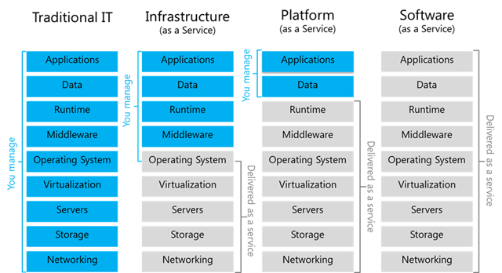

### Rapid Elasticity
Consumers can adapt to variation in workloads and mantain required performance levels. This permits also to reduce costs avoiding the overprovisining.

### High Avaialability
The cloud provide high avaialabity. This feature can be achived with redundancy of resources to avoid system failure. Some Load Balancer is used to balance the request between all the resources to avoid failure due the resources saturation on some machine.

The cloud infrastrucure can be public, if it is provisioned for open use by the general public; or private, if is provisioned for exclusive use by a single organization comprising multiple consumers.

## Cloud computering Layer
The cloud infrastrucure can be see as a layered infrastructure. 

#### Phyisical Layer
Executes requests generated by virtualization and control layer. Specifies entities that operate at this layer (devices, systems, protocols...)

## Virtual Layer
Deployed on the physical layer. Abstract physical resources and makes them appear as virtual resources. Executes the requests generated by control layer. It permits a better use of the hardware when you have services that underuse it.  With VMs there is a 10% of performance loss but we gain in flexibility, security ...

This allows a **multi tenant environment** since I can run multile organizations VMs on the same server.

The **hypervisor** is responsible for running multiple VMs. Since I want to execute x86 ISA over an x86 server I don't need to translate the code. **KVM** kernel, preempting the VOS process.
- **paravirtualization** the virtual kernel cooperates with the hosting OS.
- the CPU is aware of the virtualization, it distinguishes the interrupts generated by the vos.
- **driver integration** you don't have to emlulate all the drivers but you can ask the underlying OS for this service.

Each VM has a **configuration file** where there are the values aswering the questions: how much memory, how much disk, where is the disk file, how many CPU's cores ...

The disk is virtualized usign a file, while for the Network there are a VNIC (Network Interface Card) connected to a VSWITCH, comunicating with the physical NIC. The VNIC is used also by the real OS because it's physical NIC is busy doing the VSWITCH.  
The Virtual Disk is a file of fixed size or dynamically expanding. The VOS can be shared among the VMs and stored elsewhere than in the vdisk file. Each write goes on the vdisk (can undo all the write ops), instead each read first look in the "file" where the VOS is, than in the vdisk file if the previous check wasn't successful.  

The Virtual CPU masks the feature of a CPU to a VM. The VCPU can be overbooked, up to twice the number of cores. The CPU has several rings of protection (user ... nested vos,vos,os).

#### About the virtual memory:  
It's not allowed to use a virtual memory as VM RAM because the sum of the VM RAM should be less or equal to the actual RAM. Fragmentation could be a problem if there is lot of unused reserved memory.

##### Balooning 
It is sayd to the VM: "Look, you have 1TB of RAM but most of it it's occupied". In this way we have dynamically expanding blocks of RAM: if the OS needs memory I can deflate the baloon.

#### Other considerations about the Virtual Layer
The persistent state of a VM is made of the **conf file** and the file of the disk. Mooving a VM it's really simple: just stop it and moove the two files just mentioned.  

##### vMotion -  Live Migration
Mooving a VM from server A to B while it's running. The user could experience a degradation of the service but not a disruption.
- copy the RAM and at the end, copy the pages writed during this phase.
- create an empty drive on B
- copy the CPU registers (the VM is stopped for a really short period)
- manage VSwitch and ARP protocol. The virtual switch must be aware of the migration: if the old vswitch receives a pkt for the just migrated VM it should send it to B.
- continue running the VM on B, only when it needs the disk you stop it and start copying the disk file. A jumboframe can be used to avoid storage traffic fragmentation.

#### Docker
It exploits Linux's Resource Group. The processes in the container can see only a part of the OS. The containers have to share the networking. Docker separates different software stacks on a single node.

## Control Layer
Enables resource configutarion and resource pool configuration. Enable resource provisioning. Execute requests generated by service layer. It takes physical or virtual resources and puts them in a common domain allocating existing and new resources.

**open stack**  
Good idea but bad implementation. Various open source softwares, difficult to deply, lots of dead code, bad security implementation. It has a small form of orchestration but it's not a service orchestrator( i.e. no distribution of the workload, scaling)

### Service orchestration Layer
Provides workflow for executing automated tasks. 

## Business Continuity 
#### Backups
It' a data protection solution.

**RTO** Recovery Time Objective: time it will take to have a full recovery.  
**RPO** Recovery Point Objective: what is the last consistent copy of the storage I will find. How many data points do you have to go back in time?

Network it's the first problem when I want to make a backup, beacuse the size of the backup is bigger than the network bandwidth.  
Sometimes it's simply impossible to make a backup.

**incremental backup**
Backup only the updated parts. High RTO cause I have to reconstruct all the files hierarchy going back througth the back ups. Some times snapshots are needed.

**image level**  
uses snapshots. It's agentless (agent == client), the agent can't crash since there isn't one.

**backup windows**  
the horizon effect: you decide a window but the stuff you need will be always in the deleted part.

some servers + backup unit  
some others servers + some other backup unit

Take the hash of two identical files, store only one of the two files and both the hashes.

The **replica** it's a whole complete copy.  The syncronous replica needs an acknowledgement before proceeding. DBs like Oracle, Sequel Servers want syncronous replica. 
With the **backup** you can choose the chunk of files to "backup".

### Security
Firewall, Antivirus, Standard procedures to direct safe execution of operations...

Three levels of security:
- **Procedural**: phising, the weakest link is the human.
- **Logical**: abstraction produced by the OS. **mandatory access** (classification of the infos); **discreptional access** (~ ACL)
- **Physical**

Access Control Lists are difficult to manage with lots of users.  
**PAM** (linux) Password Authentication Module: few systems use ACL via PAM.

**auditing** activity of checking that system security is properly working. Keep monitoring the interaction of the user on a resource; get an allert when something suspicious occurs.

MINIMUM PROVILEGE PRINCIPLE : every user must be able to access only the information and resources that are necessary for its legitimate purpose.

**right != privilege**  
The first is given to you by someone, the second it's posssesed by you just because who you are.  
In Windows you (the admin) can take the ownership, but you can't give it. Noone logs as **system** (like linux root but in Windows). SID in Windows is unique for the entire system. (sysprep, sys internals, process explorer)

**OAuth** authorization mechanism  
**OpenID** authentication
**RBAC** Roled Based Access Control

**Kerberos** based on symmetric crypthography. The clietn first asks for a ticket to the Kerbero's KDC, then it can access the resource.

**byometric security** : once it gets compromized can't be restored, because you can't change someone biometrical data.

Disable the possibility of changing the MAC address at the hypervisor level.

#### Firwall
- **level 3 firwall**: looks at the envelop, source address, port ...
- **level 7 firewall**: reconstruct the full pkt looking inside it's content.

---

Share the identities of the users to not replicate them in each server:
- **lDAP** lightweight Directly Access Protocol: distributed database organized as a tree where we store the name of the users.

- **active-directory**: uses a secure protocol to exchange credentials throught the network. It's a centralized data structure listing users.

### Service Managment
Be aware of regulations and legal constraints that define how to run a system.

Level of compliancy to the policy. Demonstrate compliancy. Is this system behaving according to the regulations?  
Information processors (cloud providers) are responsible of the infos they process.

**SLA** Service Level Agrrement: legal contract thet you sign as a customer to the provider defining what the user is paying for.  
**service avaiability** = 1 - (downtime/ agreed service time)  
The uptime is difficult to define and to test because the reachability of the cloud depend also from the service providers.

The lower the resources used, the higher the margin got. Low level magrgin business: very high numbers * low margins = big profits.

**Service Operation** is crucial, it keeps up the whole thing running.  
**Service Level** not only functional requirements.

Ensure **charge-back** (pay per use), **show-back** (I exhausted the resources so I need more): make a good use of the money spent on hardware, people. Measure how much are you efficient in spending money.

**TCO** Total Cost Ownership: time cost, resource ...  
Reducing risk is a kind of **ROI** Return On Investment.

**CAPEX** CAPital EXpenses: buy something.
**OPEX** OPerational EXpences (use sometihing)

**capacity planning**: make some forecast to find when we will exhaust the resources and how many resources we will really need.  
**monitoring**: collecting data (in a respectfull way).

Keep track of things, processes, servers, configurations so that you can roll back.

**Incident/Problem Management**
Indentify the impact of a failure to all the other services.

Overcommitment of resources can bring to capacity issues.

## GDPR General Data Protection Regulation
About protection personal data. What's a personal data? i.e. matricola, email, phone number.. it's everything that uniquely identifies you.

GDPR applies both to digital and not digital information. 

If you, as an individual, get damaged by a bad use of your personal data, you can complain to the data owner and get compensated.

## Vendor Lock-in
The cloud introduces some problems, one of them is the vendor lock-in. It appers when I write a software that uses a vendor API that not respects any standard. If I would like to change cloud I use, I need to modify the code (good luck!).

Even in Open Source there is vendor lock-in due to the difficulty of mooving from the dependency of a software to another one. To avoid the vendor lock-in you should relay on different softwares and vendors.

### Standardization-Portability
It' rare that a leading vendor define a common standard. Standardization it's important but it's not feasable. It partly avoids lock-in. ""The only thing that can be standardize it's the VM"". Every platform tends to have its own API. REST is the standard that is working today in the cloud.

# Orchestration

2 types of orchestration:
- low level: eg. installation of a new VM
- high level: eg. configuration of the new VM. At the end of this process the VM will be up and running

# Fog Computing
The fog computing is an architecture that uses one or more collaborative end-user clients or near-user edge devices to carry out a substantial amount of storage (rather than stored primarily in cloud data centers), communication (rather than routed over the internet backbone), control, configuration, measurement and management (rather than controlled primarily by network gateways such as those in the LTE core network).

# Miscellaneous

**greenfield installation** : format, configure everything from scratch.

**license** : boundary to the number of installations you can have.

It's acceptable that some users experiments performances issues while upgrading.

**Procedures** are really important: knowing the procedure and applying it can avoid lost of data, users, money.

**NIC teaming**

**Erasure Coding** like RAID 5 (xor)

### Redundancy

Try to have links in rings insteand of single lines. 

Some services run in multiple **zones**.  
**Service Availability Zones**: system divided in zones, thing is some zone can fail togheter, but things from different zones can't. Run multiple istances on different zones (i.e racks). They can describe also geographical localtions. 

**cross connection** typical pattern for redundancy.

**active-passive** the II system is off and will be online only in case of failure of the first one.  
**active-active** i.e. two links aggregated both working.

**active/passive failure**: when a system fails but also the "passive" part fails immediatly because I haven't checked it.

**n+1, n+2 schema** : need n components, deploy n+1 

**multipath** give different addresses to each component.

# In class exercises

## 1 - Discuss the difference between spine and leaf fabric and the more traditional fabric architecture based on larger chassis. How bandwidth and latency are affected?

## Spine and Leaf
Non modular, fixed switches are interconnected with some MLAG (Multi-chassis Link Aggregation). Loosely copuled form of aggregation: the two switches are independent and share some form of aggregation. LCP protocol allowing to bind multiple links to a single conceptual link (link aggregation, active-active).  
**over-subscription** the links to the spine should be able to sustain the trafic coming from all the links below. This is not a problem for EW trafic between servers attached to the same switch (because the link to the spine is not affected).  
Pros:
- resilient
- active-active
- can be uptdated while the system is running

It became popular after 10 GBps; before it was difficult to use it with 4/8/16 ports per server. Different VLANs are used.

## Traditional Chassis
Tipically two modular chassis connected by two links (STP) in atcive-passive (the second chassis goes up only when the first isn't working). The ration between the number of ports and the bandwidth is completely different from spine and leaf. Link aggregation is possible but it's not convenient.  
Pros:
- room for growing
- protection on the investment
- share power
- pay only once and just add line cards
- ~ simplifying the cabling 

Today is not so much used because it's difficult to design a backplane offering terabits.  
- **Capex and Opex reasons**: in active-passive I use only half of the bandwidth I'm paying for.  
- **latency issues**: with STP when a link goes down it can take up to seconds to activate the other link.

---

## 2 - What actions can take the orchestration layer of a cloud system, and based on what information, in order to decide how many web server istances should be used to serve a Web system?

  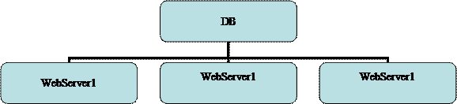

- Assuming the DB is distributed and has infinite capacity, because tipically the bottleneck is the Web Server

An orchestrator can:
- create new VM running the WS, getting a new IP and talking to the **Load Balancer**
- delete a VM
- save a VM (freezing it)
- increase memory
- etc..

Based on:
- average response time
- available memory in the WS
- latency on web requests (if it goes beyond a treshold spawn another service)
- number of connections (requests)
- CPU usage

## 3 - Discuss a datacenter architecture made of 10 racks. Assuming a power distribution of 15 W/ rack.
Use an in row cooling approach trying to reduce the rows to be cooled. Do not forget to mention the PDU and the UPS. (2 plugs per rack 32A each).

## 4 - A service requires a sustained throughput towards the storage of 15 GB/s. Would you recomment using a SAN architecture or an hyperconvergent one.

- 15 GB is the max bandwidth of a PCI express bus with 16 lanes.  
- 100 Gbps bandwidth of a single link (even if internally is 4*25 Gbps).  
- 15 GBps * 8 = 120 Gbps  
- The PCI has some overhead, so it's bandwidth is not fully 15 GB.  
- 15 GB = 54 TB/hour = 1 PB/day = half exaB / year. I have also to consider where am I  going to store this data, not focusing only on the bandwidth.  
- 8/ 10 TB mechanical drive capacity.  
- SATA SSD has 500 MB bandwidth.  
- With 15 GB/sec, 4 fiber channel are enougth.

### SAN area network (recap)
ISCSI internet protocol (SCSI on fiber) allows to mount blocks/disks.  
Block-based access: you mount a chunk of bytes seen as a drive.  
LUN (Logical UNits), can be replicated, compression can be used, it can be overbooked.  
Servers and drives are separated, drives are pooled togheter.

- **Capex and Opex reasons**: When I first buy the SAN I need to pay extra room for growing (Capex cost). The risk is to be surpasses by technology changes (not good investment, bad ROI). Overprovision sometimes could be bad: suboptimal allocation of resources.

### NAS
It uses istead a network file system protocol to access the pooled resources (SIFS, NFS). We access files not blocks.   
NAS gives the file system, with SAN I decide the FS.  
Security in SAN is bounded to the compute OS, which decide the authentication domain.
Istead NAS has the responsibility of the security and the filesystem abstraction (Active Directory and NFS security).

Both SAN and NAS separate the sotrage from the compute. Configure one for all the storage (backup, compression...) and look at it as blocks or files.  
This architecture is failing because of the throughput of the drive (very fast) that saturates the link.

### HCI (hyperconvergent)
Before we talked about three independent units: compute, storage and network. With  HCI istead we have boxes (servers) with a little bit of network, drive and compute.

It's not true that the compute and the drive are completely unrelated and can be completely separated: also the CPUs have their own limits in data processing even if large (risk to waist resources).

HCI by Nutanix allows to simply add a bit of storage, a bit of compute and a bit of network by buying a server. You pay as you grow.

#### Discussion
The choice depends also on the kind of data I assume to process (assume at least one: sensors, bank financial data ...). For example HCI is not convenient if a want to do archiving because I pay for extra unused CPU.  

It's not enought to say: I take 5 big drives, because their bandwidth can be a bottleneck.

SAN could be the good solution because it's cheaper. SAN can be used with **tiering**: in the first layer I keep SSD "buffers",  in the second layer mechanical drives. If I keep a buffer of 1TB I'll have a minute to copy down the buffered data to the mech drives.

## What should I look for..
- Capex Opex
- Resilience
- Bandwidth (network, drives)
- etc... 

## 5 - A service requires a sustained throughput towards the storage of 15 GB/s. How would you dimension an hyperconvergent system to ensure it works properly?

Look first at the network (fabric is the glue of the infrastructure).  
Can't have 100 GBps to the server because of spine and leaf.

Just 1 or 2 ports of 100Gbps are enought to saturate the PCIe. 

Not good to have 100Gbps for each node cause I'm overloading that single node while HCI is distributed.

400 GBps links are used for spine.  
Better 10 GBps or 25GBps depending on Capex.  
With spine and leaf I have 50 Gbps  cause I double (active-active).

Consider at leat 5 full used nodes with 25 Gbps network. Since I want to have some redundancy and efficiency I can use 8 to 10 nodes. I'm overprovisioning but it's good.

Every HCI node will have some SSD (at leat 2, 1 GB/sec writing) and some mechanical drives.  If I use SATA drives I need al leat 6 for each node because the bottle neck is in their bandwidth. I can use NVMe drives: lower number but I pay more.

- **Consider SLA**: how much I gonna pay for the missed target/data? If it's a lot it's better to overprovision.

Remember that bandwidth are not fully used because of some overhead..

# References
 - https://tools.ietf.org/html/rfc4391
 - https://en.wikipedia.org/wiki/Omni-Path
 - https://en.wikipedia.org/wiki/Remote_direct_memory_access
 - https://www.arubacloud.com/infrastructures/italy-dc-it1.aspx
 - https://en.wikipedia.org/wiki/Software-defined_networking
 - https://en.wikipedia.org/wiki/Software-defined_storage
 - https://en.wikipedia.org/wiki/Software-defined_data_center
 - https://en.wikipedia.org/wiki/Spanning_Tree_Protocol#Rapid_Spanning_Tree_Protocol
 - https://en.wikipedia.org/wiki/Multitier_architecture
 - https://blog.westmonroepartners.com/a-beginners-guide-to-understanding-the-leaf-spine-network-topology/
 - http://searchdatacenter.techtarget.com/definition/Leaf-spine
 - https://en.wikipedia.org/wiki/Network-attached_storage
 - https://en.wikipedia.org/wiki/Non-RAID_drive_architectures
 - https://en.wikipedia.org/wiki/Fog_computing
 - https://www.openfogconsortium.org
 - https://en.wikipedia.org/wiki/Power_usage_effectiveness
 - https://howdoesinternetwork.com/2015/what-is-a-non-blocking-switch
 - https://en.wikipedia.org/wiki/Network_function_virtualization
 -http://www.itc.unipi.it/index.php/2016/02/23/comparison-of-solid-state-drives-ssds-on-different-bus-interfaces/
- http://www.itc.unipi.it/wp-content/uploads/2016/05/ITC-TR-02-16.pdf
- https://www.nutanix.com/hyperconverged-infrastructure/