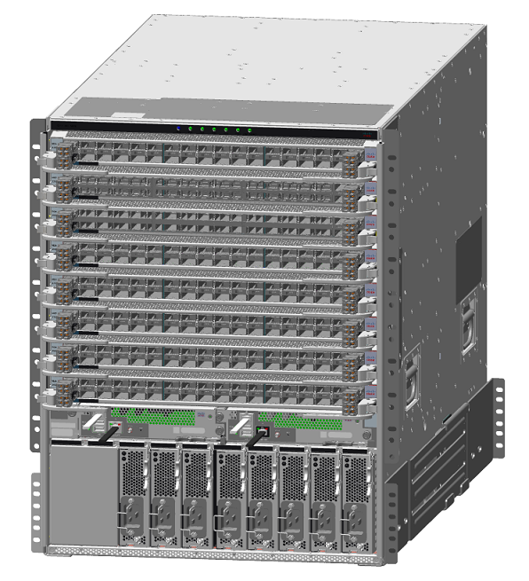
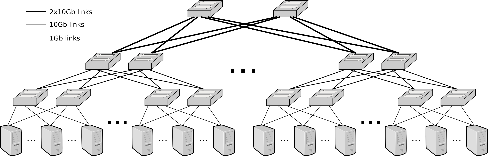
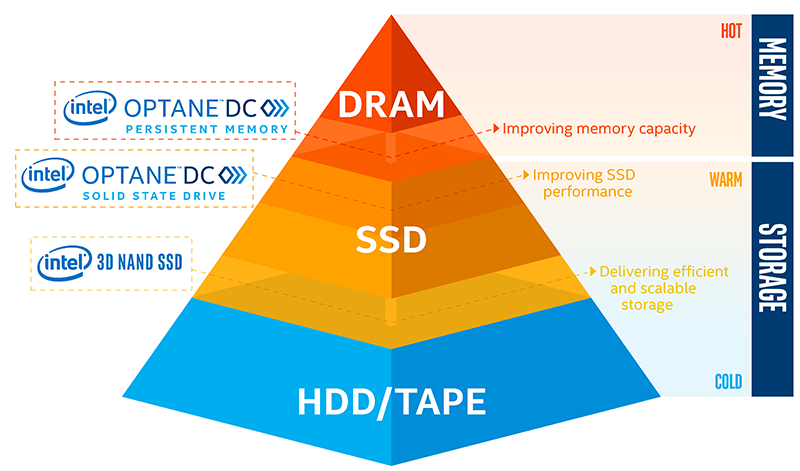
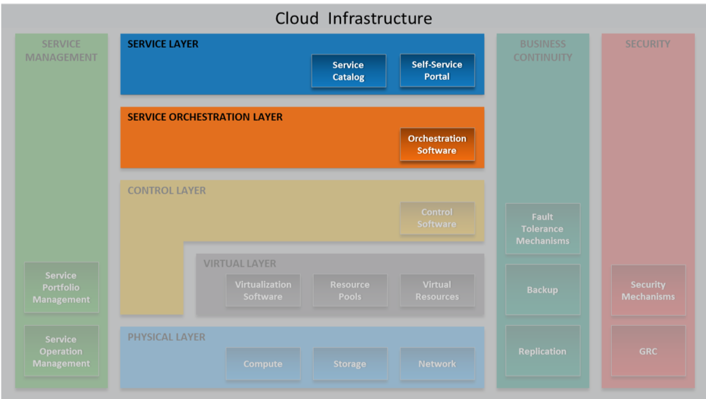
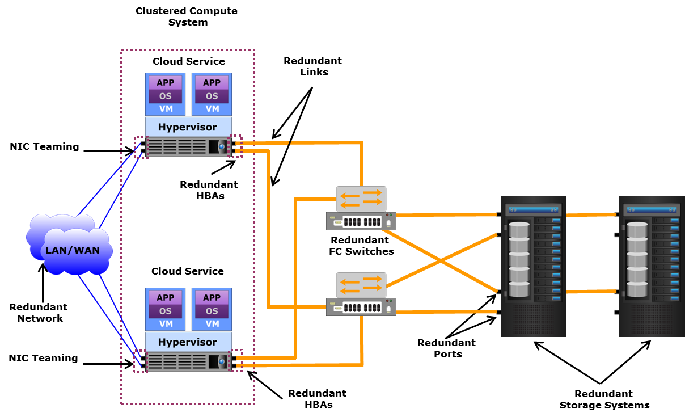
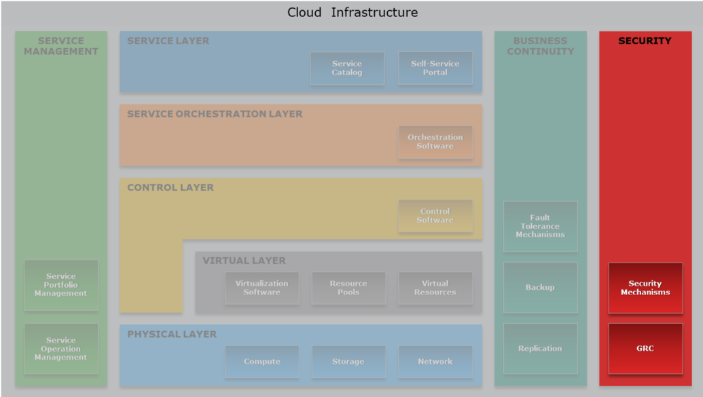

ICT Infrastructures - University of Pisa (Italy)

*Since there is only little material on ICT Infrastructures course, this is a recap and summary of classes. The notes are a compilation of the course contents and focus on the topics in accordance with Prof. Antonio Cisternino's OneNote Notebook. 
It is highly recommended to study with the EMC DELL slides provided under <<_Raccolta contenuto>> which will not be uploaded here for copyright reasons. Each heading correspond to a module. If you find any error please, fork and submit a pull request!*

# Table of contents

  
Click to show or hide

<!-- START doctoc generated TOC please keep comment here to allow auto update -->
<!-- DON'T EDIT THIS SECTION, INSTEAD RE-RUN doctoc TO UPDATE -->

- [Introduction](#introduction)
- [Cloud Computing Reference Model [Module 2]](#cloud-computing-reference-model-module-2)
- [Data centers](#data-centers)
- [Design and Architectures](#design-and-architectures)
  - [Cooling](#cooling)
      - [CRAC: Computer Room Air Conditioner](#crac-computer-room-air-conditioner)
      - [Hot/Cold aisles](#hotcold-aisles)
      - [In-Row cooling](#in-row-cooling)
      - [Liquid cooling](#liquid-cooling)
      - [Other ideas](#other-ideas)
  - [Current](#current)
    - [Power Distribution](#power-distribution)
      - [Power factor](#power-factor)
    - [PUE: Power Usage Effectiveness](#pue-power-usage-effectiveness)
- [Fabric](#fabric)
  - [Ethernet](#ethernet)
  - [Infiniband](#infiniband)
  - [RDMA: Remote Direct Memory Access](#rdma-remote-direct-memory-access)
  - [Omni-Path](#omni-path)
  - [Connectors & plugs](#connectors--plugs)
  - [Software Defined Approach](#software-defined-approach)
    - [SDN: Software Defined Networking](#sdn-software-defined-networking)
    - [Software-defined data center](#software-defined-data-center)
    - [Hyper-convergence](#hyper-convergence)
  - [Network topologies](#network-topologies)
    - [Introduction](#introduction-1)
      - [Small-world theory](#small-world-theory)
      - [Spanning Tree Protocol (STP)](#spanning-tree-protocol-stp)
      - [Network Chassis](#network-chassis)
      - [Stacking](#stacking)
    - [Three-tier design](#three-tier-design)
    - [Spine and leaf Architecture](#spine-and-leaf-architecture)
    - [Oversubscription](#oversubscription)
    - [Some considerations about numbers](#some-considerations-about-numbers)
    - [Full Fat Tree](#full-fat-tree)
    - [VLAN](#vlan)
    - [Switch Anatomy](#switch-anatomy)
    - [Network topology with firewalls](#network-topology-with-firewalls)
- [Disks and Storage](#disks-and-storage)
  - [Interfaces](#interfaces)
  - [Redundancy](#redundancy)
  - [Memory Hierarchy](#memory-hierarchy)
    - [NVMe](#nvme)
    - [nvDIMM](#nvdimm)
    - [Misc](#misc)
  - [Storage aggregation](#storage-aggregation)
  - [Network Area Storage (NAS)](#network-area-storage-nas)
  - [Storage Area Network (SAN)](#storage-area-network-san)
  - [HCI - Hyperconvergent Systems](#hci---hyperconvergent-systems)
  - [SDS - Software Defined Storage](#sds---software-defined-storage)
  - [Non-RAID drive architectures](#non-raid-drive-architectures)
  - [Some consideration about Flash Drives](#some-consideration-about-flash-drives)
  - [Storage in the future](#storage-in-the-future)
- [Servers](#servers)
  - [Types of compute systems](#types-of-compute-systems)
  - [Form-factors](#form-factors)
  - [Misc](#misc-1)
- [Cloud](#cloud)
  - [Cloud computing Layers](#cloud-computing-layers)
    - [Cross functional layers](#cross-functional-layers)
    - [Physical Layer](#physical-layer)
    - [Virtual Layer](#virtual-layer)
      - [VM Network components](#vm-network-components)
      - [VM components](#vm-components)
      - [Types of virtualization](#types-of-virtualization)
      - [Virtual Machine (VM)](#virtual-machine-vm)
      - [vRAM ballooning](#vram-ballooning)
      - [Docker](#docker)
    - [Control Layer](#control-layer)
      - [Key phases for provisioning resources](#key-phases-for-provisioning-resources)
      - [Thin provisioning](#thin-provisioning)
      - [Open stack](#open-stack)
    - [Service layer](#service-layer)
      - [Service layer](#service-layer-1)
    - [Orchestration layer](#orchestration-layer)
      - [Cloud portal](#cloud-portal)
      - [Orchestration types](#orchestration-types)
      - [Orchestration APIs](#orchestration-apis)
      - [Example of orchestration workflows](#example-of-orchestration-workflows)
      - [Service orchestration](#service-orchestration)
    - [Business Continuity layer](#business-continuity-layer)
      - [Single point of failure](#single-point-of-failure)
      - [Redundancy](#redundancy-1)
      - [Service Availability Zones](#service-availability-zones)
      - [Live Migration of a VM](#live-migration-of-a-vm)
      - [Server Setup Checklist](#server-setup-checklist)
      - [Backups](#backups)
    - [Security layer  (TODO: complete)](#security-layer--todo-complete)
      - [Levels of security](#levels-of-security)
      - [Firwall](#firwall)
    - [Service Managment layer](#service-managment-layer)
      - [Service Operation management](#service-operation-management)
      - [Capacity Planning/ Management](#capacity-planning-management)
      - [Incident/Problem Management](#incidentproblem-management)
      - [Examples](#examples)
      - [GDPR General Data Protection Regulation](#gdpr-general-data-protection-regulation)
      - [Vendor Lock-in](#vendor-lock-in)
      - [Standardization-Portability](#standardization-portability)
  - [Misc](#misc-2)
- [In class exercises](#in-class-exercises)
  - [1) Spine and leaf VS traditional architecture](#1-spine-and-leaf-vs-traditional-architecture)
    - [Question](#question)
    - [Solution](#solution)
  - [Spine and Leaf](#spine-and-leaf)
  - [2) Orchestration layer](#2-orchestration-layer)
    - [Question](#question-1)
    - [Solution](#solution-1)
  - [3) Datacenter architecture](#3-datacenter-architecture)
    - [Question](#question-2)
    - [Solution](#solution-2)
  - [4) SAN VS Hyperconvergent architecture](#4-san-vs-hyperconvergent-architecture)
    - [Question](#question-3)
    - [Solution](#solution-3)
  - [5) Dimension a hyperconvergent system](#5-dimension-a-hyperconvergent-system)
    - [Question](#question-4)
    - [Solution](#solution-4)
- [Other questions](#other-questions)
- [About numbers](#about-numbers)
  - [Current](#current-1)
  - [Fabric](#fabric-1)
  - [Disk and Storage](#disk-and-storage)
- [Real Use Cases](#real-use-cases)
- [Open Source](#open-source)
- [Books & Guides](#books--guides)
- [References](#references)
- [Contributors](#contributors)

<!-- END doctoc generated TOC please keep comment here to allow auto update -->

# Introduction
The ICT world is changing (and will keep changing beyond the last time these notes were updated) and a lot of axioms about its infrastructures are becoming outdated. A couple of examples:

- a few years ago it was known that the main bandwidth bottleneck was the disk, and so a system's whole performance was evaluated with reference to disk usage, number of IOs operations and so on... This, nowadays, is false.  Just think of [Intel Optane SSD](https://www.anandtech.com/show/11702/intel-introduces-new-ruler-ssd-for-servers) where the new SSD technology based on 3D NAND permits to write and read faster than previous SSD, and so we have to redesign the entire system accordingly. Additionally, nvRAM (non-volatile RAM) are becoming more of an industry standard. nvRAM is a storage module similar to the hard drive but much faster. 

- In application and server distribution. In the past many applications were managed on each server with a shared storage. Nowadays we have deploy a large application on server clusters (i.e. a server node composed of multiple units working together as one) with local storage, so new system to develop and manage distributed computing application is needed (Hadoop, Cassandra, Spark...).

<!-- The world is evolving faster than this summary. It so maybe some things written here are already obsolete, so we can not waste any more time on introduction to avoid to need to rewrite the introduction.  -->

# Cloud Computing Reference Model [Module 2]
Since the course revolves around Cloud Computing architectures, it is important to keep the following reference model of the cloud stack in mind:
<!-- Just a brief overview on the reference model of cloud computing: -->

  

 
 1. **Physical Layer [Module 3]**: Foundation layer of the cloud infrastructure.
The physical infrastructure supporting the operation of the cloud
 2. **Virtual Layer [Module 4]**: Abstracts physical resources and makes them appear as virtual resources. e.g. a physical server is partitioned into many virtual ones to use the hardware better.  The *High Performance Computing* model bypasses the virtual layer for performance reasons.
 3. **Control Layer [Module 5]**: Dynamic Resource configuration and allocation.
 4. **Orchestration Layer [Module 6]**: workflows for task automation.
 5. **Service Layer [Module 6]**: self-service portal/interface and service catalog. Allows cloud users to obtain the resources they need without knowing where they are allocated.
 6. **Service Management [Module 9]**: on operational and business level
 7. **Business Continuity [Module 7]**: Enables ensuring the availability of services in line with SLAs. 
 e.g. *Backups* vs *Replicas*: doing a backup of 1 PB may be a problem.  
  *Fault Tolerance*: I should be able to power off a server without anyone noticing it.
  *live migration*: upgrading the software or the firmware while the system is running.
  8. **Security [Module 8]**: Governance, Risk and compliance. Also things like GDPR, phishing, antivirus, firewalls and DoS Attacks..

# Data centers

We start the course with datacenter design, see how it is built to support current and future design considerations, scalability, etc. 

A data center is a facility used to house computer systems and associated components, such as telecommunications and storage systems. It generally includes redundant or backup components and infrastructure for power supply, data communications connections, environmental controls (e.g. air conditioning, fire suppression) and various security devices. A large data center is an industrial-scale operation using as much electricity as a small town.

On average there are only 6 person managing 1 million servers.
Prefabricated group of racks, already cabled and cooled, are automatically inserted in the datacenter (POD - Point Of Delivery). If something is not working in the prefabricated, the specific server is shut down. If more than the 70% is not working the POD producer will simply change the entire unity.

The datacenter is a place where we concentrate IT system in order to reduce costs. Servers are demanding in terms of current, cooling and security. 

# Design and Architectures

## Cooling

Today cooling is air based. Just the beginning for liquid cooling.  
The air pushed though the server gets a 10/15 degrees temperature augment.

#### CRAC: Computer Room Air Conditioner

Popular in the '90 (3-5KW/rack), but not very efficient in terms of energy consumption. 
There is a *floating floor*, under which all the cabling and the cooling is performed. The air goes up because of thermal convection where it gets caught, cooled and re-introduced.

Drawbacks are density (if we want to go dense this approach fails) and the absence of locality. No one is using this technique today.

  

#### Hot/Cold aisles

The building block of this architecture are hot and cold corridors, with servers front-to-front and back-to-back; that optimize cooling efficiency.

The *workload balancing* may be a problem: there can be the situation where a rack is hotter than the other depending on the workload, thus is difficult to module the amount of hot and cold air. In the CRAC model the solution is pumping enough for the higher consumer, but is not possible to act only where needed. That leads waste of energy. This problem is not present in the in-row cooling technology.

  

#### In-Row cooling

In-row cooling technology is a type of air conditioning system commonly used in data centers (15-60 kW/rack) in which the cooling unit is placed between the server cabinets in a row for offering cool air to the server equipment more effectively.

In-row cooling systems use a horizontal airflow pattern utilizing hot aisle/cold aisle configurations and they only occupy one-half rack of row space without any additional side clearance space. Typically, each unit is about 12 inches wide by 42 inches deep.

These units may be a supplement to raised-floor cooling (creating a plenum to distribute conditioned air) or may be the primary cooling source on a slab floor.

  

The in-row cooling unit draws warm exhaust air directly from the hot aisle, cools it and distributes it to the cold aisle. This ensures that inlet temperatures are steady for precise operation. Coupling the air conditioning with the heat source produces an efficient direct return air path; this is called *close coupled cooling*, which also lowers the fan energy required. In-row cooling also prevents the mixing of hot and cold air, thus increasing efficiency.

It's possible to give more cooling to a single rack, modulating the air needed. In front of the rack there are temperature and humidity sensors. Humidity should be avoided because can condensate because of the temperature differences and therefore conduct electricity.
There are systems collecting data from the sensors and adjusting the fans. The racks are covered to separate cool air and hot air. It's also possible to optimize the datacenter cooling according to the temperature changes of the region where the datacenter is and apply "static analysis" to the datacenter location, in order to optimize resource consumption according to temperature changes. Programs are available in order to simulate airflows in datacenter in order to optimize the fans. 

Usually every 2 racks (each 70 cm) there should be a cooling row (30 cm).

#### Liquid cooling
It's also called CoolIT, consists in making the water flow directly onto the CPUs.  
Having water in a data center is a risky business, but this solution lowers the temperature for ~40%. One way of chilling the water could be pushing it down to the ground. Water Distribution System, like the Power Distribution System.

A lot of research has been lately invested towards oil cooling computers, particularly in the contest of High Performance Computing. This is a more secure solution because the mineral oil is not a conductor and allows to immerse everything in the oil, in order to maximize the effectiveness of the cooling. The problem of this technique is that the cables slowly pump the oil out.

#### Other ideas
A typical approach to cool the air is to place chillers outside the building, or by trying geocooling, which revolves around using the cold air in depth. The main idea is to make a deep hole in the ground, and make the cables pass through it. 

## Current
A 32KW datacenter is small (also if it consumes the same amount of current of 10 apartments).  

*Direct Current Transformers* from AC to DC. Direct current is distributed inside the datacenter even if is more dangerous than alternating current.

  

Where  gives the efficiency of the power supply and generally it changes according to the amount of current needed (idle vs under pressure).  is the heat dissemination happening from conversion of AC into DC current, and it is a number <= 1.
For example an idle server with 2 CPUs (14 cores each) consumes 140 Watts.

### Power Distribution
The Industrial current has 380 Volts in 3 phases. The amount of current allowed in a data center are the Ampere on the *PDU* (Power Distribution Unit).

There are one or more lines (for reliability and fault tolerance reasons) coming from different generators to the datacenter (i.e. each line 80 KW , 200 A more or less. Can use it for 6 racks 32A / rack. Maybe I will not use the whole 32 A so I can put more racks).  

The lines are attached to an *UPS (Uninterruptible Power Supply/Source)*. It is a rack or half a rack with batteries (not enough to keep-on the servers) that in some cases can power the DC for ~20 minutes. Them are also used to prevent current oscillation. There are a *Control Panel* and a *Generator*. When the power lines fail the UPS is active between their failure and the starting of the generator and ensure a smooth transition during the energy source switching. The energy that arrives to the UPS should be divided among the servers and the switches.

The UPS is attached to the *PDU* (Power Distribution Unit) which is linked to the server. For redundancy reasons, a server is powered by a pair of lines, that usually are attached to two different PDU. The server uses both the lines, so that there will be continuity in case of failure of a line. In the server there are the power plugs in a row that can monitored via a web server running on the rack PDU. 

Example of rack PDU: 2 banks, 12 plugs each, 16 A each bank, 15 KW per rack, 42 servers per rack.

#### Power factor

  
Click to expand

Alternating current (AC) supplies our buildings and equipment. AC is more efficient for power companies to deliver, but when it hits the equipment's transformers, it exhibits a characteristic known as reactance.

Reactance reduces the useful power (watts) available from the apparent power (volt-amperes). The ratio of these two numbers is called the power factor (PF). Therefore, the actual power formula for AC circuits is watts = volts x amps x power factor. Unfortunately, the PF is rarely stated for most equipment, but it is always a number of 1.0 or less, and about the only thing with a 1.0 PF is a light bulb.

For years, large UPS systems were designed based on a PF of 0.8, which meant that a 100 kVA UPS would only support 80 kW of real power load.

The majority of large, commercial UPS systems are now designed with a PF of 0.9. This recognizes that most of today's computing technology presents a PF of between 0.95 and 0.98 to the UPS. Some UPS systems are even designed with PFs of 1.0, which means the kVA and kW ratings are identical (100 kVA = 100 kW). However, since the IT load never presents a 1.0 PF, for these UPS systems, the actual load limit will be the kVA rating.

 Use the hardware manufacturers' online configurations if possible. As a last resort, use the server's power supply rating -- a server with a 300-Watt power supply can never draw 800 Watts. Size the power systems based on real demand loads.

Dual-corded equipment adds redundancy to IT hardware, and the lines share power load. If a dual-corded server has two 300-Watt power supplies, it can still draw no more than 300 Watts in your power design, because each power supply has to be able to handle the server's full load (not including power supply efficiency calculations).

The other way to estimate total server power consumption is to use industry norms. Unless you're hosting high performance computing, you can probably figure groupings in three levels of density: Low density cabinets run 3.5 to 5 kW; medium density run 5 to 10 kW; high density run 10 to 15 kW. The amount of each rack type to allocate depends on your operation. Generally, data centers operate with about 50% low density cabinets, 35% medium and 15% high density.

If your projected average is more than 1.5 times your existing average, take a closer look at the numbers. This result is fine if you expect a significant density increase, due to new business requirements or increased virtualization onto blade servers. But if there's no apparent reason for such a density growth, re-examine your assumptions.

### PUE: Power Usage Effectiveness

PUE is a ratio that describes how efficiently a computer data center uses energy; specifically, how much energy is used by the computing equipment (in contrast to cooling and other overhead).

PUE is the ratio of total amount of energy used by a computer data center facility  to the energy delivered to computing equipment. PUE is the inverse of data center infrastructure efficiency (DCIE).

As example, consider that the PUE of the university's datacenter during 2018 is less 1.2, while the average italian data center's PUE are around 2-2.5.

If the PUE is equal to 2 means that for each Watt used for computing, 1 Watt is used for cooling.

  

# Fabric
The fabric is the interconnection between nodes inside a datacenter. We can think this level as a bunch of switch and wires. 

We refer to North-South traffic indicating the traffic outgoing and incoming to the datacenter (internet), while we refer to East-West as the internal traffic between servers.

## Ethernet
The connection can be performed with various technologies, the most famous is **Ethernet**, commonly used in Local Area Networks (LAN) and Wide Area Networks (WAN). Ethernet use twisted pair and optic fiber links. Ethernet as some famous features such as 48-bit MAC address and Ethernet frame format that influenced other networking protocols. 

**MTU** (Maximum Transfer Unit) up to 9 KB with the so called **Jumbo Frames**.
On top of ethernet there are TCP/IP protocols (this is a standard), they introduce about 70-100 micro sec of latency.

The disadvantage of Ethernet is the low reliability.

## Infiniband 
Even if Ethernet is so famous, there are other standard to communicate. **InfiniBand (IB)**, by Mellanox, is another standard used in high-performance computing (HPC) that features very high throughput and very low latency (about 2 microseconds). InfiniBand is a protocol and a physical infrastructure and it can send up to 2GB messages with 16 priorities level.
The [RFC 4391](https://tools.ietf.org/html/rfc4391) specifies a method for encapsulating and transmitting IPv4/IPv6 and Address Resolution Protocol (ARP) packets over InfiniBand (IB).

InfiniBand transmits data in packets up to 4KB. A massage can be:
 - a remote direct memory access read from or write to a remote node ([**RDMA**](#rdma-remote-direct-memory-access))
 - a channel send or receive
 - a transaction-based operation (that can be reversed)
 - a multicast transmission
 - an atomic operation

Pros:
 - no retransmissions
 - QoS, traffic preserved, reliable

## RDMA: Remote Direct Memory Access
Access, a direct memory access (really!) from one computer into that of another without involving either one's OS and bypassing the CPU. This permits high-throughput and low-latency networking performing. RDMA can gain this features because is not a protocol, but is on API, hence there is no overhead.

RDMA supports zero-copy networking by enabling the network adapter to transfer data directly to or from application memory, eliminating the need to copy data between application memory and the data buffers in the operating system, and by bypassing TCP/IP. Such transfers require no work to be done by CPUs, caches, or context switches, and transfers continue in parallel with other system operations. When an application performs an RDMA Read or Write request, the application data is delivered directly to the network, reducing latency and enabling fast message transfer. The main use case is distributed storage.

  

## Omni-Path
Moreover, another communication architecture that exist and is interested to see is Omni-Path. This architecture is owned by Intel and performs high-performance communication([Ompni-Path Wikipedia](https://en.wikipedia.org/wiki/Omni-Path)). 
The interest of this architecture is that Intel plans to develop technology based on that will serve as the on-ramp to exascale computing (a computing system capable of the least one exaFLOPS). 

## Connectors & plugs
Now we try to analyse the problem from the connector point of view. The fastest wire technology available is the optic fiber. It can be divided into two categories:
 - mono-modal (1250 nm): expensive, lower loss, covers distances up to 60KM. Used in WAN/MAN
 - multi-modal (850 nm): cheap, covers distances up to 2KM. Used in datacenters

 They also have different transceiver. There are two kind of connectors:
  - LC: ok for datacenters
  - SC: usually used in metropolitan areas because it has a better signal propagation
  
  There can be a cable with a LC in one side and a SC on the other side.  

 Of course, a wire is a wire, and we need something to connect it to somewhere (transceiver):
  - **SPF** (Small form-factor pluggable), a compact, hot-pluggable optical module transceiver
    - 1 Gbps
  - **SFP+**, can be combined with some other SFP+
    - 10 Gbps
  - **QSFP** (Quad SPF)
    - 4x10 Gbps (if combined with SPF+)
  - **SFP28**, where the number 28 is the number of pins
    - 25 GBps
  - **QSFP28** (Quad SPF28)
    - 4x25 Gbps (if combined with SFP28)
  - **RJ45**, in datacenters there are almost no installations of it 
    - 10/100 Mbps, 1/2.5/5 Gbps.
    - Different cables have categories (cat4, cat5, cat6) 
      - 2.5/5 Gbps are new standards working on cat5 and cat6 cables respectively, in order to deliver more bandwidth to the WiFi access point. 

RJ45 | SPF+ | QSPF+ transceiver module | LC connector
:-:|:-:|:-:|:-:
  |   |  | 

Nowadays we have:
- 25 Gbps 
- 50 Gbps (2 * 25)
- 100 Gbps (4 * 25)

The **transceiver module** can serve copper or optical fiber; it has a microchip inside and is not cheap.

## Software Defined Approach

The Software Defined Approach, where approach is Networking ([**SDN**](#sdn-software-defined-networking)) or Storage ([**SDS**](#sds---software-defined-storage)), is a novel approach to cloud computing. 

Software-defined approach abstracts all the infrastructure components (compute, storage, and network), and pools them into aggregated capacity. It separates the control or management functions from the underlying components to the external software, which takes over the control operations to manage the multi-vendor infrastructure components centrally. 
This decoupling enable to centralize all data provisioning and management tasks through software, external to the infrastructure components.
The software runs on a centralized compute system or a standalone device, called the software-defined controller.

Benefits of software-defined approach:
- Improves business agility: minimizes resource provisioning time to get new services up and running
- Provides cost efficiency: enables to effectively use the existing infrastructure and low-cost commodity hardware to lower CAPEX
- Enables to achieve scale-out architecture 
- Provides a central point of access to all management functions

### SDN: Software Defined Networking
SDN is an architecture purposing to be dynamic, manageablea and cost-effective ([SDN Wikipedia](https://en.wikipedia.org/wiki/Software-defined_networking#Concept)). This type of software create a virtual network to manage the network with more simplicity.

The main concept are the following:
 - Network control is directly programmable (also from remote)
 - The infrastructure is agile, since it can be dynamically adjustable
 - It is programmatically configured and is managed by a software-based SDN controller
 - It is Open Standard-based and Vendor-neutral

There is a **flow table** in the switches that remembers the connection. The routing policies are adopted according to this table.  
Deep packet inspection made by a level 7 firewall. The firewall validates the flow and if it's aware that the flow needs bandwidth, the firewall allows it to bypass the redirection (of the firewall). 
<!-- 
The new wave of network switch strongly revolves around the concept of "programming" and "monitoring" the switch. Dell and also Onie (open source on github) provides a way to install any OS and use third party tools to monitor the switching.
-->

### Software-defined data center
Software-defined data center is a sort of upgrade of the previous term and indicate a series of virtualization concepts such as abstraction, pooling and automation to all data center resources and services to achieve IT as a service.

### Hyper-convergence
So we virtualize the networking, the storage, the data center... and the cloud! Some tools, as [Nutanix](https://www.nutanix.com/hyperconverged-infrastructure/) build the [hyper-converged infrastructure HCI](https://en.wikipedia.org/wiki/Hyper-converged_infrastructure) technology.

Hyper-converged infrastructure combines common datacenter hardware using locally attached storage resources with intelligent software to create flexible building blocks that replace legacy infrastructure consisting of separate servers, storage networks, and storage arrays.

## Network topologies

A way of cabling allowing multiple computers to communicate. It's not necessary a graph,but for the reliability purpose it often realized as a set of connected  nodes. At least 10% of nodes should be connected in order to guarantee a sufficient reliability ([Small World Theory](#small-world-theory)).

At layer 2 there is no routing table (*broadcast domain*), even if there are some cache mechanism. The topology is more like a tree than a graph because some edges can be cutted preserving reachability and lowering the costs. In the layer 2 topology computers talk each other, for that reason there is no scalability.
The layer 2 topology is widely used for broadcasting.

At layer 3 there are routing tables, them are keep updated by a third part, the router. The L3 topology is the mainly used for point-to-point communication.

In switches there are routing tables but them are used just for cache, switches working also without routing tables.

### Introduction

#### Small-world theory
This [theory](https://en.wikipedia.org/wiki/Small-world_network), formulated by Watts and Strogatz, claims that 6 hops connect us with every person in the world.
According to their studies, taken two people x and y respectively strangers, x can send a message to y just asking to his acquaintances to pass the message to someone closer to y. Hop by hop, the message reaches y going only through friends of friends. On average, this operation needs only 6 steps.

For this reason, a good network topology should take 6 hops on average to connect 2 machines.
Actually, topologically we got more than 6 hops, but adding 10% of random links across the graph the hops number easly collapse to 6.

#### Spanning Tree Protocol (STP) 

First of all it is necessary to understand the loop problem. A loop is a cycle of the links between various nodes which creates a "DDoS-like" situation by flooding the network.   
The spanning Tree Protocol is a network protocol that builds a logical loop-free topology for Ethernet networks. Taken a node as root, it builds a spanning tree from the existing topology graph, and disables all the arch that are not in use. The graph is now totally converted into a tree.

In networking the spanning tree is built using some Bridge Protocol Data Units (BPDUs) packages.
In 2001 the IEEE introduced Rapid Spanning Tree Protocol (RSTP) that provides significantly faster spanning tree convergence after a topology change.

The advantage of the Spanning Tree protocol is that unplugging a link the network will autofix in less than a minute, rebuilding a new tree with the edges previously discarded. However, nowadays it is used only in campus and not in datacenters, due to its high latency of convergence (up to 10-15 seconds to activate a backup line) that is not sufficient for an always-on system.

#### Network Chassis
The Network Chassis is a sort of big  modular and resilient switch. At the bottom it has a pair of power plugs and then it's made of modular **line cards** (with some kind of ports) and a pair of **RPM** Routing Processing Modules (for redundancy) to ensure that the line cards work. The chassis can be over provisioned to resist to aging but it has a limit.  

  

Pros
- resilient
- 1 CLI per switch
- expandable

Cons
- expensive
- not entirely future proof (today some switches may need up to 1KW power supply, while years ago they needed only 200 W)
- aging problem

The chassis is connected with the rack's **tor** and **bor** (top/bottom of rack) switches via a double link. 

#### Stacking

Some network switches have the ability to be connected to other switches and operate together as a single unit. These configurations are called stacks, and are useful for quickly increasing the capacity of a network.

It's cheaper than the chassis but there is less redundancy and it is not upgradable without connectivity.

### Three-tier design

This architecture is simple architecture where each component has a redundant unit to replace it in case of failure.

### Spine and leaf Architecture

  
  

With the increased focus on east-west data transfer the three-tier design architecture is being replaced with Spine-Leaf design. The switches are divided into 2 groups, the leaf switches and spine switches. Every leaf switch in a leaf-spine architecture connects to every switch in the network fabric.

That topology uses the **Link Aggregation Control Protocol (LACP)** to avoid loops. Two different links to two different ports are bounded into a logical link. That means that both links can be used to communicate, gaining the redundancy in case of failure of a link, but there are no loops because them are saw as a single channel.
LACP provides a method to control the **bundling of several physical ports together to form a single logical channel**. The **first two ports of every switch are reserved** to create a link with a twin switch (a loop is created, but the OS is aware of that and it avoids it). Next ports are the ones used to create links with leaf nodes. The **bandwidth is aggregated** (i.e. 2*25 Gbps), but it's still capped to 25 Gbps because the **traffic goes only from one way to the other** each time.

Usually in a spine and leaf architecture the NS traffic, that connect the datacenter to Internet, is slow and the EW traffic, that is server-to-server and rack-to-rack is very intensive.

Characteristics:
- fixed form factor (non modular switches)
- active-active redundancy
- loop aware topology (a tree topology with no links disabled for redundancy reasons).
- interconnect using standard cables (decide how many links use to interconnect spines with leaves and how many others link to racks).

With this architecture it's possible to turn off one switch, upgrade it and reboot it without compromising the network. Half of the bandwidth is lost in the process, but the twin switch keeps the connection alive.

A typical configuration of the ports and bandwidth of the leaves is:
- 1/3 going upwards and 2/3 going downwards
- 48 ports 10 Gbps each (downward - from leaves to racks)
    - plus 6 ports 40 Gbps each (upward - from leaves to spines)
- or 48 ports 25 each (downward)
    - plus 6 ports 100 each (upward)

  

Just a small remark: with spine and leaf we introduce **more hops**, so more latency, than the chassis approach. The solution for this problem is using as a base of the spine a **huge switch (256 ports)** which actually acts as a chassis, in order to reduce the number of hops and latency.

### Oversubscription

Another factor to keep in mind when designing your fabric is the **oversubscription ratio**. In a leaf-spine design, this oversubscription is measured as the **ratio of downlink ports** (to servers/storage) **to uplink ports** (to spine switches). If you have 20 servers each connected with 10Gbps links and 4 10Gbps uplinks to your spine switches, you have a 5:1 oversubscription ratio (200Gbps/40Gbps). Significant increases in the use of multi-core CPUs, server virtualization, flash storage, Big Data and cloud computing have driven the requirement for modern networks to have lower oversubscription. Current **modern network designs** have oversubscription ratios of **3:1** or less.

Is it possible to achieve a degree of oversubscription equal to 1?
Yes, and it is possible by just linking half the ports upwards and half down. This is the basis of the full fat tree.

### Some considerations about numbers

  

    Click to show or hide
  

Start think about real world. We have some server with 1 Gbps (not so high speed, just think that is the speed you can reach with your laptop attaching a cable that is in classroom in the university). We have to connect this servers to each other, using switches (each of them has 48 ports). We have a lots of servers... The computation is done.

  

As we see we need a lots of bandwidth to manage a lots of service and even if the north-south traffic (the traffic that goes outside from our datacenter) can be relatively small (the university connection exits on the world with 40 Gbps), the east-west traffic (the traffic inside the datacenter) can reach a very huge number of Gbps. [Aruba datacenter](https://www.arubacloud.com/infrastructures/italy-dc-it1.aspx) (called IT1) with another Aruba datacenter (IT2) reach a bandwidth of 82 Gbps of Internet connection.
  

### Full Fat Tree

In this network topology, the link that are nearer the top of the hierarchy are "fatter" (thicker) than the link further down the hierarchy. **Used only in high performance computing** where performances have priority over budgets.

The full fat tree **resolves the problem of over-subscription**. Adopting the spine and leaf there is the risk that the links closer to the spines can't sustain the traffic coming from all the links going from the servers to the leaves. The full fat tree is a way to build a tree so that the capacity is never less than the incoming traffic. It's **quite expensive** and because of this reason some over subscription can be accepted.

  

### VLAN

Now, the problem is that every switch can be connected to each other and so there is no more LANs separation in the datacenter, every packet can go wherever it wants and some problems may appear. VLANs solve this problem partitioning a broadcast domain and creating isolated computer networks.

A virtual LAN (VLAN) is a virtual network consisting of virtual and/or physical switches, which **divides a LAN into smaller logical segments**. A VLAN groups the nodes with a common set of functional requirements, independent of the physical location of the nodes. In a multi-tenant cloud environment, the provider typically creates and assigns a **separate VLAN to each consumer**. This provides a private network and IP address space to a consumer, and ensures isolation from the network traffic of other consumers. 

It works by applying **tags** (from 1 to 4094) to network packets (in Ethernet frame) and handling these tags in the networking systems. 

  

A **switch can be configured to accept some tags** on some ports and some other tags on some other ports. 

VLAN are useful to manage the **access control** to some resources (and avoid to access to some subnetwork from other subnetwork). Different VLANs are usually used for different purposes.

### Switch Anatomy
A switch is an ASIC (Application-Specific Integrated Circuit). It can be proprietary architecture or non-proprietary. Layer 2 switches receive packets and implements the equivalent of a bus: store and forward (there is a special address allowing broadcast). At layer 3 there is no loop problem, as in layer 2, because of the Internet Table.

Datacenter's switches are usually **non-blocking**. It basically means that this switches have the forwarding capacity that supports concurrently **all ports at full capacity**.

Now some standard are trying to impose a common structure to the network elements (switch included) to facilitate the creation of standard orchestration and automation tools.

The internal is made of a **control plane** which is configurable and a **data plane** where there are the ports and where the actual switching is made. The control plane evolved during the years, now they run an OS and Intel CPU's. Through a CLI Command Line Interface it's possible to configure the control plane. Some examples of command are:
- show running config
- show interfaces status 
- show vlan
- config (to enter in config mode)

Some protocols in the switch (bold ones are important):
- PING to test connectivity.
- LLDP Local Link Discovery Protocol ( a way to explore the graph).
- **STP** Spanning Tree Protocol (to avoid loops).
- RSTP Rapid-STP
- DCBX Data Center Bridging eExchange (QoS, priority)
- PFC Priority Flow Control
- ETS Enhanced Transmission Selection (priority)
- **LACP**  Link Aggregation Control Protocol (use two wires as they are one).

**ONIE** (Open Networking Installed Environment) boot loader  
The switch has a firmware and two slots for the OS images. When updating in the first slot we store the old OS image, in the second slot the new one.

**NFV** Network Functions Virtualization (5G mostly NFV based)  
The data plane is connected to a DC's VM which acts as a control plane.

### Network topology with firewalls
A Firewall can only perform security check on a flow, but cannot manage the flow itself. Furthermore, is not possible to let pass the entire traffic through the Firewall, because it would be a bottleneck. For that reason, after the security checks the firewall divert the flow directly to router and switches thanks to [OpenFlow API](https://ryu.readthedocs.io/en/latest/ofproto_ref.html).

# Disks and Storage

**IOPS**: Input/output operations per second is an input/output performance measurement used to characterize computer storage devices (associated with an access pattern: random or sequential).

## Interfaces

- SATA: with controller, slow because it is the bottleneck
- SAS (Serial Attached SCSI)
- NVMe (Non Volatile Memory express): controller-less, protocol used over PCI express bus
- ...

## Redundancy

[RAID](https://en.wikipedia.org/wiki/RAID#Standard_levels) stands for Redundant Array of Independent Disks. The RAID is done by the disk controller or the OS.   
The more common RAID configurations are:

- RAID-0: striping, two drivers aggregated that works as a single one (no fault tolerance)
- RAID-1: mirroring, write on both the drives, one is the copy of the other.
- RAID-5: block-level striping with distributed parity. It's xor based: the first bit goes in the first disk, the second bit in the second one and their xor in the third. If one disk crashes I can recompute its content with the other two (for each two bits of info I need one extra bit, so one third more disk storage). This means mirroring with only 50% more space.
- RAID-6: block-level striping with double distributed parity. Similar to RAID1 but with more disks.

## Memory Hierarchy
**Tiering** is a technology that categorizes data to choose different type of storage media to reduce the total storage cost. Tiered storage policies place the **most frequently accessed data on the highest performing storage**. Rarely accessed data goes on low-performance, cheaper storage.

  

**Caches**:
- CPU Registries
- CPU Cache

**Memory tiering**:
- RAM
- nvRAM (uses [nvDIMM](#nvdimm))

**Storage tiering**: 
- SSD Memory
- Hard drive
- Tape

### NVMe

  

It's a protocol on the PCI-express bus and it's totally **controller-less**. From the software side it's simpler in this way to talk with the disk because the driver is directly attached to the PCI, there is no controller and minor latency.

A bus is a component where I can attach different devices. It has a clock and some lanes (16 in PCI, ~15 GBps because each lane is slightly less then 1 GB). **Four drives are enough to exhaust a full PCI v3 bus**. They are also capable of saturating a 100 Gbps link, since a NVMe SSD has a bandwidth of 3.5 GBps (3.5*4 = 14 GBps => almost filled the 15 GBps of the PCI-e).

NVMe has now almost totally replaced SATA, since the latter uses 2 PCIe lines and for that reasons represents the bottleneck considering the actual SSD speed.
Furthermore, NVMe is often uses in the lower memory tier of the RAM: its speed is only one order of magnitude less than RAM, but can have a very big size without any problem. For that reason represent a valid super-fast cache level for the RAM and them started being associated in one single level to implement a big RAM tier, in a totally transparent way for the system.

Since the software latency in disk IOs is 5 microseconds more or less, TCP/IP software introduces also a latency of 70-80 microseconds, the disk is no more a problem. Indeed, the problem is now the network, not only for the latency, but also for the bandwidth: 4 NVMe totally saturates a 100 Gbps network.

### nvDIMM
[nvDIMM](https://en.wikipedia.org/wiki/NVDIMM) (non volatile Dual Inline Memory Module) is used to save energy. It allows to change the amount of current given to each line, that is as much as a SSD needs to write.

The memory power consumption is a problem, because it usually consume more current than the CPU; moreover the RAM to persists after a reboot needs to be battery-powered, that is very expensive.
With the advent of SSD and NVMe things changed, since we reach high speed with persistent memory: non-volatile memory does not need power unless the need of performing I/O operations; moreover data does not need to be refreshed periodically to avoid data loss.

nvDIMM allows to put SSDs on the memory BUS as for the RAM instead of the PCIe as for the storage.

### Misc

- Processes can share memory through the memory mapping technique (the memory is seen as a file).
- Beside Volatile RAM it's now possible to have persistent state RAM.
- With Intel Optane storage is only 35% slower then the RAM, so there is the need for supporting large non volatile memory tier with super fast access.

## Storage aggregation

Actually, the Hard Drive problem is not the speed but the latency. With a large bandwidth HDD are fast on contiguous data, but have a high latency on sparse data, on which are very slow.

Latency is due to:
- software (Filesystem, OS, ..): in a microseconds order, cannot be removed
- controller: can be reduced, e.g. with NVMe is just 20µs
- HDD latency: can drastically be reduced with SSD, and is even smaller with 3D NAND

This problems are solved with the storage aggregation technique, that is a strategy for accessing drives in parallel instead of sequentially.
It is the concept of splitting data between various disks and then "picture" the **whole system as a sole huge drive** (concept of resource pooling in cloud computing)
The **strategy for accessing drive makes the difference**.  
Fiber channel is the kind of fabric dedicated for the storage. The link coming from the storage ends up in the Host Based Adapter in the server.

## Network Area Storage (NAS)

NAS is a **file-level** computer data storage server connected to a computer network providing data access to a heterogeneous group of clients. NAS systems are networked appliances which contain one or more storage drives, often arranged into logical, redundant storage containers or RAID. They typically provide access to files using network file sharing protocols such as **NFS**, **SMB/CIFS**, or AFP over a optical fiber.

Basically **the whole storage is exposed as a file system**. When using a network file system protocol, you are using a NAS.

Storage system architectures are based on data access methods whose common variants are:
- **block-based (SAN)**: a block-based storage system enables the creation and assignment of storage volumes to compute systems. The compute OS (or hypervisor) discovers these **storage volumes as local drives**. A file system can be created on these storage volumes, for example NTFS in a Windows environment, which can then be formatted and used by applications.

  

- **file-based**: a file-based storage system, also known as Network-Attached Storage (NAS), is a dedicated, high-performance file server having either integrated storage or connected to external storage. NAS enables clients to share files over an IP network. NAS supports **NFS** and **CIFS** protocols to give both UNIX and Windows clients the ability to share the same files using appropriate access and locking mechanisms. NAS systems have integrated hardware and software components, including a processor, memory, NICs, ports to connect and manage physical disk resources, an OS optimized for file serving, and file sharing protocols. 

  

- **object-based**: object-based storage is a way to **store file data in the form of objects based on the content and other attributes** of the data rather than the name and location of the file. An object contains user data, related metadata (size, date, ownership, etc.), and user defined attributes of data (retention, access pattern, and other business-relevant attributes). The additional **metadata or attributes enable optimized search**, retention and deletion of objects. The object-based storage system uses a flat, non-hierarchical address space to store data, providing the flexibility to scale massively. Cloud service providers leverage object-based storage systems to offer Storage as a Service because of its inherent security, scalability, and automated data management capabilities. Object-based storage systems support web service access via REST and SOAP. Eg. **AWS S3**.

  

- **unified**: unified storage or multi-protocol storage has emerged as a solution that consolidates block, file, and object-based access within one storage platform. It **supports multiple protocols** such as CIFS, NFS, iSCSI, FC, FCoE, REST, and SOAP for data access

  

**iSCASI**: Internet Small Computer Systems Interface, an IP-based storage networking standard for linking data storage facilities. It provides **block-level access to storage** devices by carrying SCSI commands over a TCP/IP network.

## Storage Area Network (SAN)

A network of compute systems and storage systems is called a Storage Area Network (SAN). A SAN enables the compute systems to **access and share storage systems**. Sharing improves the utilization of the storage systems. Using a SAN facilitates centralizing storage management, which in turn simplifies and potentially standardizes the management effort.
**SANs are classified based on protocols they support**. Common SAN deployments types are Fibre Channel SAN (FC SAN), Internet Protocol SAN (IP SAN), and Fibre Channel over Ethernet SAN (FCoE SAN), ATA over Ethernet (AoE) adn HyperSCSI. It can be implemented as some controllers attached to some JBoDS (Just a Bunch of Disks).  

While NAS provides both storage and a file system, **SAN provides only block-based storage** and leaves file system concerns on the "client" side. 

The SAN **can be divided in different Logical Unit Numbers** (**LUNs**). The LUN abstracts the identity and internal functions of storage systems and **appear as physical storage** to the compute system.

- Storage capacity of a **LUN can be dynamically expanded** or reduced (**virtual storage provisioning:** It enables to present a LUN to an application with more capacity than is physically allocated to it on the storage system.)
- LUN can be created from
  - RAID set (traditional approach): suited for applications that require **predictable performance**
  - Storage pool: LUNs can be **created from the storage pool** that comprises a set of physical drives that provide the actual physical storage used by the volumes. Appropriate for applications that can tolerate performance variations.

If the drive is seen as physically attached to the machine, and a block transmission protocol is adopted that means that you are using a SAN. The optical fiber has become the bottleneck (just four drives to saturate a link).

With SAN the server has the impression that the LUN is attached directly to him, locally; with NAS there isn't this kind of abstraction.

## HCI - Hyperconvergent Systems

- Nutanix: is the current leader of this technology
- Ceph: is a different architecture/approach
- vSAN
- SSD - Storage Spaces Direct

This kind of software is **expensive** (Nutanix HCI is fully software defined so you **do not depend on the vendors hardware**).

The main idea is not to design three different systems (compute, networking, storage) and then connect them, but it's better to have a bit of them in each server I deploy. "**Adding servers adds capacity**".

  

The software works with the cooperations of different controller (VMs) in each node (server). **The controller (VM) implements the storage abstraction through the node and it implements also the logical moving of data**. Every **write keeps a copy on the local server storage** exploiting the PCI bus and avoiding the network cap; a copy of the data is given to the controller of another node. The **read is performed locally** gaining high performances. The VM is aware that there are two copies of the data so it can exploit this fact. **Once a drive fails its copy is used to make another copy** of the data. The write operation is a little bit slower since I need to wait for the 'ack' of the controller in order to keep replicas of the written data on other nodes (sync replica).

## SDS - Software Defined Storage
Software-defined Storage is a term for computer data storage software for **policy-based provisioning and management of data storage** independent of the underlying hardware. This type of software includes a storage virtualization to separate storage hardware from the software that manages it.  
It's used to build a **distributed system that provides storage services**. Uses **object-based storage architecture** (objectID, metadata, binary data).

## Non-RAID drive architectures
Also other architectures exist and are used when RAID is too expensive or not required.
 - JBOD ("just a bunch of disks"): multiple hard disk drives operated as individual independent hard disk drives
 - SPAN: A method of combining free space on multiple hard disk drives from "JBoD" to create a spanned volume
 - DAS (Direct-attached storage): a digital storage directly attached to the computer accessing it.

## Some consideration about Flash Drives
The **bottleneck** in new drives is the **connector**. The SATA connector is too slow to use SSD at the maximum speed. Some results can be see [here](http://www.itc.unipi.it/wp-content/uploads/2016/02/ITC-TR-01-16.pdf).

The solution? Delete the connector and attach it to PCIe. So new Specification is used, the NVMe, an open logical device interface specification for accessing non-volatile storage media attached via a PCI Express bus.

## Storage in the future

  

    Click to show or hide
  

  

  
  

  As we can see in the image, it's been decades since the last mainstream memory update is done. In fact, the SSD became popular in the last years due the cost but they exists since 1989. 

  

  
  

  New technology was introduced in 2015, the 3D XPoint. This improvement takes ICT world in a new phase? If yesterday our problem was the disk latency, so we design all algorithm to reduce IOs operation, now the disk is almost fast as the DRAM, as shown the following image:

  

  
  

# Servers
They are really different from desktops, the only common part is the CPU instruction set.
For instance, servers have an ECC memory with Error Correction Code built in.

Racks are divided in Units: 1 U is the minimal size you can allocate on a rack. Generally 2 meters rack has 42 Units. 

## Types of compute systems
<!--
- **Tower**: a tower compute system, also known as a tower server, is a compute system built in an upright enclosure called a “tower”, which is **similar to a desktop cabinet**. Tower servers have a robust build, and have integrated power supply and cooling. They typically have individual monitors, keyboards, and mice. Tower servers **occupy significant floor space** and require **complex cabling** when deployed in a data center. Tower servers are typically used in smaller environments. Deploying a large number of tower servers in large environments may involve substantial expenditure. -->

- **Rack-mounted**: a rack-mounted compute system is a compute system designed to be **fixed on a frame called a “rack”**. A rack is a standardized enclosure containing multiple mounting slots, each of which holds a server. A single rack **contains multiple servers stacked vertically**, thereby **simplifying network cabling**, consolidating network equipment, and reducing floor space use. Each rack server has its own power supply and cooling unit. A “rack unit” (denoted by U or RU) is a unit of measure of the height of a server designed to be mounted on a rack. One rack unit is 1.75 inches (~4.5cm). A rack server is typically 19 inches (~50cm) in width and 1.75 inches (~45cm) in height. This is called a **1U rack** server. Other common sizes of rack servers are 2U and 4U. Some common rack cabinet sizes are 27U, 37U, and 42U. Typically, a console with a video screen, keyboard, and mouse is mounted on a rack to enable administrators to **manage the servers in the rack**. Some concerns with rack servers are that they are cumbersome to work with, and they generate a lot of heat because of which more cooling is required, which in turn increases power costs.

- **Blade**: a blade compute system, also known as a blade server, **contains only core processing components**, such as processor(s), memory, integrated network controllers, storage drive, and essential I/O cards and ports. Each blade server is a **self-contained compute system** and is typically dedicated to a single application. A blade server is housed in a slot **inside a chassis**, which holds multiple blades and provides **integrated power supply**, **cooling**, **networking**, and **management** functions. The blade enclosure enables interconnection of the blades through a high speed bus and also provides connectivity to external storage systems. The modular design of blade servers makes them smaller, which **minimizes floor space** requirements, **increases** compute **system density and scalability**, and provides **better energy efficiency** as compared to tower and rack servers. 

## Form-factors

In a standard 1U (aka Pizza Box), the bottom part is composed by
 - 2 power plugs
 - networking plugs for KVM (configuration console) 
 - **BMC** (Base Management Console) which is a stand alone OS talking with the motherboard used for remote monitoring (eg. shut down)   
 
 while the front (up) part contains:
 - drives
 - immediately above them there are the fans 
 - and the disk controller. 
 
Typically the max number of CPUs is four and they are close to the memory modules.

  

- **1U** Pizza box: 2 CPUs, ~10 drives disposed horizontally.  
- **2U**: 2 CPUs, 24 drives disposed vertically.
- **2U Twin square**: 24 drives on the front disposed vertically, 4 servers 2 CPUs each, they share only the power.
- **10U Blade server**: big chassis, up to 16 servers 2 CPUs each, simpler cabling, easy management and cost reduced. 
- **Intel Ruler**: up to 1 petabyte but there is no room for CPU because it is a SS media. Possible to design a one half PB ruler with room for CPUs.

Differs from desktop systems. 
- CPU architecture with a new generation memory called [NUMA](https://en.wikipedia.org/wiki/Non-uniform_memory_access) (Non Uniform Memory Architecture). 
  - Drop the assumption that all the RAMs are equal. NUMA is supported in the most used servers and virtualizer. Create threads and process that are NUMA aware: split data in an array and each thread works on a part of it. APIs are provided in order to access specific memory zones in a NUMA architecture.
- [Hyper threading](https://en.wikipedia.org/wiki/Hyper-threading)
  - Hyper-threading makes a single processor core appear as two logical processor cores, allowing the hyper-threading enabled operating system (or hypervisor) to schedule two threads simultaneously to avoid idle time on processor. However, the two threads cannot be executed at the same time because the two logical cores share the resources of a single physical core. When core resources are not in use by the current thread, especially when the processor is stalled (for example due to data dependency), resources of the core are used to execute the next scheduled thread. 
  In this case emerges a problem of memory condivision, and the solutions are usually:
    - One cache per core
    - One cache per couple of cores
    - A shared RAM between some cores (Multi channel D-RAM:  more bandwidth than DDR)

    If I have two threads in many cases I can execute 2 istruction at time (thread overlapping, hyper threading). 
- https://en.wikipedia.org/wiki/Intel_UltraPath_Interconnect
- Inter socket and Intra socket connection:
  - initially cores used a token ring or two token rings, now they use a mash.
  - Crossbar interconnection (each CPU at the vertex of a square connected by the edges and the diagonals too) between CPU's to reduce 1 hop.

- Intel [AVX](https://en.wikipedia.org/wiki/Advanced_Vector_Extensions) CPU architecture
- MCDRAM (multi channel RAM) with less latency

## Misc

Trade-off in CPU design: high frequency, low cores. All depends on the application running: it can benefit from high frequency or not (big data systems are more about capacity than latency).

Latency is slightly higher when I access a RAM bank of another socket because I have to ask for it via a bus that interconnects them (UPI in an Intel CPU).

Inside the core there are some funtional units like: branch missprediction unit, FMA (Floating point Multiply Add). Each core has a dedicated cache at L1 and a shared cache at L2.

**SMART technology** in drives: predictive system in the drive that gives the probability that the drive will fail in the next hours. Used by the driver provider for statistics, usage patterns.

# Cloud

Is a business model. The cloud is someone else's computer that you can use (paying) to execute your application with more reliable feature than your laptop (i.e. paying for doing tests on your app using the cloud infrastructure because you need more resources). The interaction to obtain the cloud resources should be "self service" for as much as possible. 
When you program for the cloud you dont know where your process will be executed or where you data will be stored.

Cloud is a collection of **network-accessible** IT resources:
 - consists of **shared pools of hardware and software resources** deployed in data centers

One of the main concept of cloud computing is the one of pooling, which means that a set of **heterogeneous resources** can be viewed as a whole big resource in order to provide reassignment capability and location independence (which means that the client cannot control where his data are, except for maybe the geographical area). Another important concept is the one of resource measurement. The cloud computing business model revolves around pricing and resource consumption, so the system must be able to monitor it.

Cloud computing **benefits** are:
- Agility
- Reduction of IT cost (CAPEX to OPEX)
- High Availability and fault tolerance
- Business Continuity
- Rapid development and testing
- No infrastructure management

There is a trade off between centralization (the bottleneck is the storage) and distribution (the bottleneck is the network).

  

**Rapid Elasticity**: consumers can adapt to variation in workloads and maintain required performance levels. This permits also to reduce costs avoiding the overprovisining.

**High Availability**: the cloud provide high availability. This feature can be achieved with redundancy of resources to avoid system failure. Some Load Balancer is used to balance the request between all the resources to avoid failure due the resources saturation on some machine.

The cloud infrastructure can be **public**, if it is provisioned for open use by the general public; or **private**, if is provisioned for exclusive use by a single organization comprising multiple consumers.

## Cloud computing Layers

The cloud infrastructure can be see as a **layered infrastructure**. 

### Cross functional layers
In the cloud computing reference model there are some sylos of cross layer functionalities, they mainly revolve around:
- Business Continuity: In data center failure is the norm, so I have to consider business continuity. It is reactive (disaster recovery) and proactive (risk assessment, backup, replicas...).
- Security: policies, standard procedures, firewalls, antivirus, intrusion detection/prevention.
- Service Management: Portfolio (SLA, roadmap, customer support...) and operation (monitoring, provisioning, compliance...)

### Physical Layer

  

The physical layer comprises compute, storage, and network resources, which are the fundamental physical computing resources that make up a cloud infrastructure. It executes requests generated by virtualization and control layer and specifies entities that operate at this layer:
  - storage and its access method (file-based, block-based, object-based or unified)
  - network
  - compute systems
  - other resources

### Virtual Layer

  

Deployed on the physical layer. Abstract physical resources, including storage and network, and makes them appear as virtual resources. Executes the requests generated by control layer. It permits a better use of the hardware when you have services that underuse it.  With VMs there is a 10% of performance loss but we gain in flexibility and security.

Benefits of virtualization:
- optimize utilization of IT resources
- reduces cost and management complexity
- reduces deployment time
- increases flexibility

This allows a **multi tenant environment** since I can run multiple organizations VMs on the same server.

#### VM Network components

VM networks comprise virtual switches, virtual NICs, and uplink NICs that are created on a physical compute system running a hypervisor.

  
Click to expand

  - **vSwitch**: a virtual switch is a **logical OSI Layer 2 Ethernet switch** created within a compute system. A virtual switch is either internal or external. An internal virtual switch connects only the VMs on a compute system. It has no connection to any physical NIC and cannot forward traffic to a physical network. An external virtual switch connects the VMs on a compute system to each other and also to one or more physical NICs. A physical NIC already connected to a virtual switch cannot be attached to any other virtual switch.

  - **vNIC**: A virtual NIC **connects a VM to a virtual switch** and functions similar to a physical NIC. Virtual NICs send and receive VM traffic to and from the VM network. A VM can have one or more virtual NICs. Each virtual NIC has unique MAC and IP addresses and uses the Ethernet protocol exactly as a physical NIC does. The hypervisor generates the MAC addresses and allocates them to virtual NICs. 

  - **Uplink NIC**: an uplink NIC is a physical NIC connected to the uplink port of a virtual switch and functions as an **Inter-Switch Link** between the virtual switch and a physical Ethernet switch. It is called uplink because it only provides a physical interface to connect a compute system to the network and **is not addressable from the network**. Uplink NICs are **neither assigned an IP address nor are their built-in MAC addresses** available to any compute system in the network. It simply forwards the VM traffic between the VM network and the external physical network without modification.

  

    
  

#### VM components

The **hypervisor** is responsible for running multiple VMs. Since I want to execute x86 ISA over an x86 server I don't need to translate the code. An hypervisor **permits to overbook physical resources** to allocate more resources than exist and it also create also a **virtual switch to distribute the networking** over all VMs. 

Hypervisors types:
  - **Bare-metal**: directly installed on the hardware. It has **direct access to the hardware** resources of the compute system. Therefore, it is more efficient than a hosted hypervisor. However, this type of hypervisor may have limited device drivers built-in. Therefore, hardware certified by the hypervisor vendor is usually required to run bare-metal hypervisors. A bare-metal hypervisor is designed for enterprise data centers and cloud infrastructure. 
  - **Hosted**: installed as an application on an operating system. In this approach, the hypervisor **does not have direct access to the hardware** and all requests must pass through the operating system running on the physical compute system.

#### Types of virtualization

Types of virtualization:
  - **paravirtualization** the virtual kernel cooperates with the hosting OS.
    - the CPU is aware of the virtualization, it distinguishes the interrupts generated by the vOS.
  - **driver integration** you don't have to emlulate all the drivers but you can ask the underlying OS for this service.

#### Virtual Machine (VM)

Each **Virtual Machine** is a **set of discrete configuration files** where there are the values aswering the questions: how much memory, how much disk, where is the disk file, how many CPU's cores. An example of those files are:
  - configuration file: stores information, such as VM name, BIOS information, guest OS type, memory size
  - virtual disk file: stores the contents of the VM's disk drive
  - memory state file: stores the memory contents of a VM in a suspended state
  - snapshot file: stores the VM settings and virtual disk of a VM

The disk is virtualized usign a file, while for the Network there is a VNIC (Network Interface Card) connected to a vSWITCH, comunicating with the physical NIC. The vNIC is used also by the real OS because it's physical NIC is busy doing the vSWITCH.  

  

The Virtual Disk is a file of fixed size or dynamically expanding. The vOS can be shared among the VMs and stored elsewhere than in the vdisk file. Each write goes on the vdisk (can undo all the write ops), instead each read first look in the "file" where the vOS is, than in the vdisk file if the previous check wasn't successful. I can also freeze the virtual disk, and extend the file with the software I want to add, making also rollback possible. This file abstraction for the disk makes also possible the application of a copy on write mechanism. I can use the same portion of file to save an operating system, and then create only one virtual disk file containing the differences between the various virtual machine and the original disk (more or less like image layering in Docker*). 

The Virtual CPU masks the feature of a CPU to a VM. The VCPU can be overbooked, up to twice the number of cores. The CPU has several rings of protection (user ... nested vos,vos,os).

#### vRAM ballooning

It's not allowed to use a virtual memory as vRAM because the sum of the vRAM should be less or equal to the actual RAM. Fragmentation could be a problem if there is lot of unused reserved memory. In order to achive this, a technique called ballooning has been introduced.  
It is said to the VM: "Look, you have 1TB of RAM but most of it it's occupied". In this way we have dynamically expanding blocks of RAM: if the OS needs memory I can deflate the baloon by moving the occupancy threshold.

#### Docker

It exploits Linux's Resource Group. The processes in the container can see only a part of the OS. The containers have to share the networking. Docker separates different software stacks on a single node.

### Control Layer

  

The control layer includes control software that are **responsible for managing and controlling  the underlying cloud infrastructure resources and enable provisioning of IT resources** for creating cloud services. Control layer can be deployed on top of the virtual layer or on top of the physical layer. This layer receives request from the service and orchestration layers, and interacts with the underlying virtual and physical resources for provisioning IT resources. For example, **when a consumer initiates a service request (a VM instance with 4 GB RAM and 500 GB storage), based on the workflow defined by the orchestration layer for this service, the control layer provisions the required resources from the resource pool to fulfill the service request**. This layer also exposes the resources (physical and/or virtual) to and supports the service layer where cloud services interfaces are exposed to the consumers. 

The **key functions** of the control layer includes:
- resource **configuration**
- resource **provisioning**
- **monitoring** resources. 

Summarizing, **control software**:

- Enables **resource configuration** and resource **pool configuration**
- Enables resource **provisioning**
- Executes **requests** generated **by service layer**
- **Exposes resources** to and supports the service layer
- Collaborates with the virtualization software and enables:
  - **Resource pooling** and creating **virtual resources**
  - **Dynamic allocation** of resources
  - **Optimizing utilization** of resources

#### Key phases for provisioning resources

- Resource **discovery**: create an inventory of the infrastructure resources, so that unified manager can learn what resources are available for cloud service deployment
- Resource **pool management**: virtual resources such as VM, virtual volume, and virtual network are created from these pools and provisioned for the services
- Resource **provisioning**: involves allocating resources from graded resource pools to the service instances

#### Thin provisioning

This is a **virtualization technology** that gives the **appearance of having more physical resources than are actually available**. Thin provisioning allows space to be easily allocated to servers, on a just-enough and just-in-time basis. Thin provisioning is called "sparse volumes" in some contexts.

#### Open stack 

A **free and open-source software platform for cloud computing**, mostly deployed as infrastructure-as-a-service (IaaS), whereby virtual servers and other resources are made available to customers.

**Good idea but bad implementation**. Various open source softwares, difficult to deply, lots of dead code, bad security implementation. It has a small form of orchestration but it's not a service orchestrator (i.e. no distribution of the workload, scaling)

### Service layer

  

**What is a cloud service?**  
Cloud services are IT resources that are packaged by the service providers and are offered to the consumers. Once constituent IT resources are provisioned and configured, a service is instantiated.

#### Service layer

The service layer has three key functions which are as follows: 
- **Enables defining services in a service catalog**: cloud service providers should ensure that the consumers are able to view the available services, service level options, and service cost that will help them effectively to make the right choice of services. Cloud services are defined in a **service catalog**, which is a menu of services offerings from a service provider. The catalog provides a central source of information on the service offerings delivered to the consumers by the provider, so that the consumers can get a standard, accurate and consistent view of services that are available to them.

 - **Enables on-demand, self-provisioning of services**: a service catalog also allows a consumer to request or order a service from the catalog that best matches the consumer’s need **without manual interaction with a service provider**. While placing a service request, a consumer commonly submits service demands, such as required resources, needed configurations, and location of data. Once a service request is approved by the provider, appropriate resources are provisioned for the requested service. 

 - **Presents cloud interfaces to consume services**: cloud interfaces are the functional interfaces and the **management** interfaces of the deployed service instances. Using these interfaces, the consumers perform computing activities, such as executing a transaction and administer their use of rented service instances, such as modifying, scaling, stopping, or restarting a service instance.

### Orchestration layer

  

Automated arrangement, coordination, and management of various system or component functions in a cloud infrastructure to provide and manage cloud services.

#### Cloud portal

A cloud portal is an access (usually web-based) point to a cloud, which **provides access to the service catalog**, and facilitates **self-service provisioning** and ongoing access to the cloud interfaces. A cloud portal is also accessed by the cloud administrators to manage cloud infrastructure and the lifecycle of cloud services.

Once a service provisioning or management request is placed in the cloud portal, the **portal routes the request to the orchestration layer** where appropriate **workflows are triggered to fulfill the request**. The orchestration layer is the automation engine of the cloud infrastructure, which defines standardized workflows for process automation. The workflows help orchestrating the execution of various system functions across the cloud infrastructure to fulfill the request. 

#### Orchestration types

Tow different types of orchestration:
- low level: eg. installation of a new VM
- high level: eg. configuration of the new VM. At the end of this process the VM will be up and running

#### Orchestration APIs

APIs are used to perform activities such as:
- Resource provisioning and configuration
- Resource monitoring and management
- Service orchestration

#### Example of orchestration workflows
DB2 instance request            |  CRM instance request
:-:|:-:
  |  

#### Service orchestration

Service orchestration provides several benefits:
 - **Saves service provisioning time**: service orchestration reduces the time required to approve, configure, integrate, and provision resources and to coordinate among various service management teams. This helps rapid provisioning of services.
 - **Eliminates possibility of manual errors**: manual approach to service management is subject to errors and difficult to audit. Manual management also raises risk of deviating from increasingly stringent compliance requirements and service qualities. Service orchestration automates the coordination of system functions, which eliminates the risk of human error.
 - **Reduces operating expenses**: service orchestration reduces administration cost through end-to-end automation of service provisioning and consequently decreases the cost of providing cloud services.
 - **Simplifies cloud infrastructure management**: many common repetitive manual management activities are orchestrated in a cloud environment. Reduction of manual activities simplifies the administration of infrastructure resources and services. 

Although some manual steps (performed by cloud administrators) may be required while processing the service provisioning and management functions, service providers are looking to **automate these functions as much as possible**.

Cloud service providers typically deploy a purpose-designed **orchestration software or orchestrator** that orchestrates the execution of various system functions. **The orchestrator programmatically integrates and sequences various system functions into automated workflows** for executing higher-level service provisioning and management functions provided by the cloud portal. The orchestration workflows are **not only meant for fulfilling requests from consumers** but **also for administering cloud infrastructure**, such as **adding resources to a resource pool, handling service-related issues, scheduling a backup for a service, billing, and reporting**. 

  

### Business Continuity layer

  

Business continuity is a set of processes that includes **all activities** that a business must perform to **mitigate the impact of service outage**. Business continuity entails preparing for, responding to, and recovering from a system outage that adversely affects business operations. It describes the processes and procedures a service provider establishes to **ensure that essential functions can continue during and after a disaster**. Business continuity prevents interruption of mission-critical services, and reestablishes the impacted services as swiftly and smoothly as possible by using an automated process. Business continuity involves **proactive measures**, such as business impact analysis, risk assessment, building resilient IT infrastructure, deploying data protection solutions (**backup and replication**). It also involves **reactive countermeasures**, such as disaster recovery, to be invoked in the event of a service failure. Disaster recovery (DR) is the coordinated process of restoring IT infrastructure, including data that is required to support ongoing cloud services, after a natural or human-induced disaster occurs. 

#### Single point of failure

Single points of failure refers to any individual component or aspect of an infrastructure whose failure can make the entire system or service unavailable. Single points of failure may occur at infrastructure component level and site level (data center). 

Methods to avoid Singole Points of Failure:
- Redundancy
- Multiple service availablity zones

#### Redundancy

Redundancy is a technique used to **avoid single point of failure**. **N+1 redundancy** is a common form of fault tolerance mechanism that ensures service availability in the event of a component failure. A set of N components has at least one standby component. This is typically implemented as an **active/passive** arrangement, as the additional component does not actively participate in the service operations. The standby component is active only if any one of the active components fails. N+1 redundancy with **active/active** component configuration is also available. In such cases, the standby component remains active in the service operation even if all other components are fully functional. For example, if active/active configuration is implemented at the site level, then a cloud service is fully deployed in both the sites. The load for this cloud service is balanced between the sites. If one of the site is down, the available site would manage the service operations and manage the workload. 

Be careful to **active/passive failure**, when a system fails but also the "passive" part fails immediatly because any checks have been executed.

**Key techniques to protect compute**:
- Clustering (Two common clustering implementations are: Active/active ; Active/passive)
- [VM live migration](#live-migration-of-a-vm)

**Key techniques to protect network connectivity**:
- Link and switch **aggregation** (cross connection)
  - Link aggregation: **combines two or more parallel network links into a single logical link**, called port-channel, yielding higher bandwidth than a single link could provide. Link aggregation enables distribution of network traffic across the links and traffic failover in the event of a link failure. If a link in the aggregation is lost, all network traffic on that link is redistributed across the remaining links. 
  - Switch aggregation: **combines two physical switches and makes them appear as a single logical switch**. All network links from these physical switches appear as a single logical link. This enables a single node to use a port-channel across two switches and network traffic is distributed across all the links in the port-channel. 
- **NIC teaming**: groups NICs so that they appear as a single, logical NIC to the OS or hypervisor
- **Multipathing**: enables a compute system to use multiple paths for transferring data to a LUN on a storage system
- **In-service software upgrade**: is a technique where the software (firmware) on a network device (switch and router) can be patched or upgraded without impacting the network availability
- Configuring **redundant hot swappable components**

**Key techniques to protect storage**:  
- RAID and erasure coding
- Dynamic disk sparing
- Configuring redundant storage system components

  

#### Service Availability Zones

A service availability zone is a **location with its own set of resources and isolated from other zones** to avoid that a failure in one zone will not impact other zones. A zone can be a part of a data center or may even be comprised of the whole data center. This provides redundant cloud computing facilities on which applications or services can be deployed. 

Service providers typically **deploy multiple zones within a data center** (to run multiple instances of a service), so that if one of the zone incurs outage due to some reasons, then the service can be failed over to the other zone. They also **deploy multiple zones across geographically dispersed data centers** (to run multiple instances of a service), so that the service can survive even if the failure is at the data center level. It is also important that there should be a mechanism that allows seamless (automated) failover of services running in one zone to another. 

  

#### Live Migration of a VM

Moving a VM from server A to B (from hypervisor A to hypervisor B) while it's running. The user could experience a degradation of the service but not a disruption.

In a VM live migration **the entire active state of a VM is moved from one hypervisor to another**. The state information includes memory contents and all other information that identifies the VM. This method involves copying the contents of VM memory from the source hypervisor to the target and then transferring the control of the VM’s disk files to the target hypervisor. Next, the VM is suspended on the source hypervisor, and the VM is resumed on the target hypervisor. Because the virtual disks of the VMs are not migrated, this technique requires that both source and target hypervisors have access to the same storage. Performing VM live migration requires a high speed network connection. It is important to ensure that even after the migration, the VM network identity and network connections are preserved. 

**Live migration** summary:
- copy the **RAM** and at the end, copy the **pages** writed during this phase.
- create an empty drive on B
- copy the **CPU registers** (the VM is stopped for a really short period)
- manage vSwitch and ARP protocol. The virtual switch must be aware of the migration: if the old vSwitch receives a packet for the just migrated VM it should forward it to B.
- continue running the VM on B, only when it needs the disk you stop it and start copying the disk file. A jumboframe can be used to avoid storage traffic fragmentation.

The whole process is a little bit easier if both the VMs use a shared storage. 

  

#### Server Setup Checklist

- OS installation
- HyperVisor installation
- Creation of a virtual switch
- Selection of VLANs and making sure the traffic from that node gets tagged
- assigning an IP address
- DNS setup
- Firewall
- From the datacenter network switch, setting the VLAN in order to flow traffic to that node
- The server is ready to join the active directory (server is trusted)

Share the identities of the users to not replicate them in each server:
- **lDAP** lightweight Directly Access Protocol: distributed database organized as a tree where we store the name of the users.

- **active-directory**: uses a secure protocol to exchange credentials throught the network. It's a centralized data structure listing users.
The active directory allows for policy based management of the various servers.

#### Backups 

It' a data **protection solution**, and it should be automatized. It has become a crucial point in data center management to the extent in which cloud provider have started providing Backup-aaS and DisasterRecovery-aaS.

With **replicas are  data protection solutions**. This task becomes more challenging with the growth of data, reduced IT budgets, and less time available for taking backups. Moreover, service providers need fast backup and recovery of data to meet their service level agreements. The amount of data loss and downtime that a business can endure in terms of **RPO and RTO are the primary considerations** in selecting and implementing a specific backup strategy. 

- **RTO (Recovery Time Objective)**: time it will take to have a full recovery. Relates to the time taken to recover data from backup  
- **RPO (Recovery Point Objective)**: what is the last consistent copy of the storage I will find. How many data points do you have to go back in time? specifies the time interval between two backups. Is defined by business continuity planning. It is the maximum targeted period in which data might be lost from an IT service due to a major incident (DR - Disaster Recovery).

**Network** is the **first problem** when I want to make a backup, beacuse the **size of the backup** is bigger than the network bandwidth. Sometimes it's simply impossible to make a backup.

Backup types:

- **Incremental backup**: backup **only the updated parts**. High RTO cause I have to reconstruct all the files hierarchy going back througth the back ups. Sometimes snapshots are needed.

- **Guest level**: a VM is treated as if it is a physical compute system. A **backup agent is installed on the VM**, and it streams the backup data to the storage node. If multiple VMs on a compute system are backed up simultaneously, then the combined I/O and bandwidth demands placed on the compute system by the various guest-level backup operations can deplete the compute system resources. 

- **Image level:**  uses **snapshots**. It's **agentless** (agent == client who gathers the data that is to be backed up), the agent can't crash since there isn't one. The backup processing is performed by a proxy server that acts as the backup client. Backup is saved as a single entity called a VM image. Provides VM image-level and file-level recovery.

**Backup as a Service**: service providers offer backup as a service that enables an organization to reduce its backup management overhead. It also enables the individual consumer to perform backup and recovery anytime, from anywhere, using a network connection. 

**Backup window**: the horizon effect: you decide a window but the stuff you need will be always in the deleted part.

**Data Deduplication**: the process of detecting and **identifying the unique data segments** (chunk) within a given set of data **to eliminate redundancy**. The use of deduplication techniques significantly reduces the amount of data to be backed up in a cloud environment, where typically a large number of VMs are deployed. **Take the hash of two identical files**, **store only one** of the two files **and both the hashes**. If the same file is required in two context, it is saved one time and is served to different context.

**Replica**: the process of creating an **exact copy** of the data. The syncronous replica needs an acknowledgement before proceeding, and any additional writes on the source cannot occur until each preceding write has been completed and acknowledged.  DBs like Oracle, SQL Servers want syncronous replica. 
- **Local** replication
  - Snapshot
  - Mirroring
- **Remote** replication
  - Synchronous: typically deployed for distances less than 200 KM between the two sites
  - Asynchronous: write from a compute system is committed to the source and immediately acknowledged

### Security layer  (TODO: complete)

  

The fundamental requirements of information security and compliance pertain to both non-cloud and cloud infrastructure management. In both the environments, there are some common security requirements. However, in a cloud environment there are important additional factors, which a service provider must consider, that arise from information ownership, responsibility and accountability for information security, and the cloud infrastructure’s multi-tenancy characteristic. Therefore, **providing secure multi-tenancy is a key requirement** for building a cloud infrastructure. 

Key security threats according:
- Data leakage: occurs when an unauthorized entity (an attacker) gains access to a cloud consumer’s confidential data stored on the cloud infrastructure
  - => Data encryption, data shredding and multi-factor authentication
- Data loss
   - => Backup and replication
- Account hijacking: an attacker gains access to consumers’ accounts
   - multi-factor authentication and firewall
- Insecure APIs: exploit vulnerability in an API to breach a cloud infrastructure
  - => proper design and security reviews
- Malicious insiders
   - => access control policies 
- Denial of service
   - => limits on resource consumption
- Abuse of cloud services
   - => difficult to mitigate
- Shared technology vulnerabilities
   - => secure trusted components 

Firewall, Antivirus, Standard procedures to direct safe execution of operations.

#### Levels of security
- **Procedural**: phising, the weakest link is the human
- **Logical**: abstraction produced by the OS. **mandatory access** (classification of the infos); **discreptional access** (~ ACL)
- **Physical**
- Authentication
  - Process to ensure users or assets are who they claim to be
  - Two methods: single-factor and multi-factor
- Authorization
  - Process of determining access rights of a user, device, application, or process to a service or resource
  - Authorization should be performed only if authentication is successful
- Auditing
  - Process to evaluate the effectiveness of security enforcement mechanisms

Technical security mechanisms must be deployed at:
 - Compute level
 - Network level
 - Storage level

Just a bunch of terms:  
Physical security; Identity and access management; Role-based access control; Network monitoring and analysis; Firewall; Intrusion detection and prevention system ;Adaptive security ; Port binding and fabric binding ;Virtual private network; Virtual LAN and virtual SAN; Zoning and iSNS discovery domain ; Security hypervisor and management server ; Virtual machine hardening ;Securing operating system and applications;LUN masking; Data encryption; Data shredding .

Disabling all unused devices and ports

Access Control Lists are difficult to manage with lots of users.  
**PAM** (linux) Password Authentication Module: few systems use ACL via PAM.

**auditing** activity of checking that system security is properly working. Keep monitoring the interaction of the user on a resource; get an allert when something suspicious occurs.

MINIMUM PRIVILEGE PRINCIPLE : every user must be able to access only the information and resources that are necessary for its legitimate purpose.

**right != privilege**  
The first is given to you by someone, the second it's posssesed by you just because who you are.  
In Windows you (the admin) can take the ownership, but you can't give it. Noone logs as **system** (like linux root but in Windows). SID in Windows is unique for the entire system. (sysprep, sys internals, process explorer)

**OAuth** authorization mechanism, based on OTP tokens.
**OpenID** authentication
**RBAC** Roled Based Access Control

**Kerberos** based on symmetric crypthography. The client first asks for a ticket to the Kerbero's KDC, then it can access the resource using the same token.

**byometric security** : once it gets compromized can't be restored, because you can't change someone biometrical data.

Disable the possibility of changing the MAC address at the hypervisor level.

#### Firwall
- **level 3 firwall**: looks at the envelope, source address, port ...
- **level 7 firewall**: reconstruct the full pkt looking inside its content.

  

### Service Managment layer

  

Cloud service management has a service-based focus, meaning that the **management functions are linked to the service requirements and service level agreement** (SLA). Be **aware of regulations and legal constraints** that define how to run a system. Is this system behaving according to the regulations? Recap that information processors (cloud providers) are responsible of the data they process.

**SLA** Service Level Agreement: legal contract that you sign as a customer to the provider defining what the user is paying for.

**Service availability** = 1 - (downtime/ agreed service time)  
The uptime is difficult to define and to test because the reachability of the cloud depend also from the service providers.

#### Service Operation management

Service Operation management is crucial, it keeps up the whole thing running. 
Maintains cloud infrastructure and deployed services, ensuring that services and service levels are delivered as committed. Ideally, service operation management **should be automated**:
  - Service management tools automate many management activities
  - Orchestrated workflows integrate functions of management tools  
  - Activities
    - Handling of infrastructure configuration
    - Resource provisioning
    - Problem resolution
    - Capacity planning
    - Availability and performance conformance
    
**Service Level** not only functional requirements.

Ensure **charge-back** (pay per use), **show-back** (I exhausted the resources so I need more): make a good use of the money spent on hardware, people. Measure how much are you efficient in spending money.

**TCO (Toal Cost of Ownership)**: estimates the **full lifecycle cost of owning service** assets. The cost includes capital expenditure (**CAPEX**), such as procurement and deployment costs of hardware and on-going operational expenditure (**OPEX**), such as power, cooling, facility, and administration cost. 

**ROI (Return On Investment)**: reducing risk is a kind of ROI

**CAPEX (CAPital EXpenses)**: buy something. It's a one time cost e.g procurement and deployment costs of hardware .

**OPEX (OPerational EXpences)**: use something. It's a recurrent cost e.g power, cooling, facility, and administration costs.

#### Capacity Planning/ Management

Capacity Planning/ Management: make some forecast to find when we will exhaust the resources and how many resources we will really need.  Ensure that a cloud infrastructure is able to **meet the required capacity demands** for cloud services in a cost effective and timely manner.  

Common Methods to Maximize Capacity Utilization:
- Resource **pooling**
- **Over-commitment** of processor cycles and memory (it can bring to capacity issues)
- Automated VM **load balancing** across hypervisors
- **Dynamic scheduling** of virtual processors across processing cores
- **Thin provisioning**
- Automated **storage tiering**
- Dynamic VM **load balancing across storage volumes**
- **Converged network**
- **Automatic reclamation** of capacity when a service is terminated

**Monitoring**: collecting data (in a respectfull way). Availability Monitoring, Capacity Monitoring, Performance Monitoring, Security Monitoring.

Monitoring **benefits**:
 - Helps to track the availability and **performance** status of infrastructure components and services 
 - Helps to analyze the **utilization** and consumption of resources by service instances
 - Helps to track **events** that **may impact availability** and performance
 - Helps in **metering**, **reporting**, and **alerting**
 - Helps to present information as service **metrics to consumers**

 Examples of **Performance-related Changes**:
 - Allocating **more memory to VMs** running cloud management software
 - **Migrating** a service **to a different availability zone**
 - **Moving** application instances **to a public cloud** in a hybrid cloud environment
 - Changing policy for **balancing client workload** across servers

**Keep track** of things, processes, servers, configurations **so that you can roll back**.

#### Incident/Problem Management

**Incident/Problem Management**  
Indentify the impact of a failure to all the other services.  
Return cloud services to consumers as quickly as possible when unplanned events, called ‘incidents’, cause an interruption to services or degrade service quality.
- Tracks service degradation period/downtime to check for SLA violations  

Prevent incidents that share common symptoms or—more importantly—root causes from reoccurring, and to minimize the adverse impact of incidents that cannot be prevented.

#### Examples

Examples of Business Continuity Solutions
 - **Clustering** of compute systems to provide automated service failover
 - **Replicating** a database and hypervisor’s native file system continuously
 - Deploying **multiple availability zones**, enabling automated service failover globally
 - Creating **redundant** network links between devices, sites, and clouds in a hybrid cloud

#### GDPR General Data Protection Regulation
About protection personal data. What's a personal data? i.e. matricola, email, phone number.. it's everything that uniquely identifies you.

GDPR applies both to digital and not digital information. 

If you, as an individual, get damaged by a bad use of your personal data, you can complain to the data owner and get compensated.

#### Vendor Lock-in
The cloud introduces some problems, one of them is the vendor lock-in. It appers when I write a software that uses a vendor API that not respects any standard. If I would like to change cloud I use, I need to modify the code (good luck!).

Even in Open Source there is vendor lock-in due to the difficulty of mooving from the dependency of a software to another one. To avoid the vendor lock-in you should relay on different softwares and vendors.

#### Standardization-Portability
It' rare that a leading vendor define a common standard. Standardization it's important but it's not feasable. It partly avoids lock-in. ""The only thing that can be standardize it's the VM"". Every platform tends to have its own API. REST is the standard that is working today in the cloud.

## Misc

**Greenfield installation** : format, configure everything from scratch, in opposition with **brownfield installation**: network is already existing, routers, hosts... I have to mantain support for legacy stuff and integrate the new technology. Greenfield installation is typically used when an infrastructure does not exist and an organization has to build the cloud infrastructure starting from the physical layer.

**software licenses**: boundary to the number of VM that I can have with that software running.

It's acceptable that some users experiments performances issues while upgrading.

**Procedures** are really important: knowing the procedure and applying it can avoid lost of data, users, money.

**Erasure Coding** like RAID 5 (xor), with n drives of data and k drives of informations

# In class exercises

## 1) Spine and leaf VS traditional architecture

### Question
Discuss the difference between spine and leaf fabric and the more traditional fabric architecture based on larger chassis. How bandwidth and latency are affected?

### Solution

## Spine and Leaf
Non modular, fixed switches are interconnected with some MLAG (Multi-chassis Link Aggregation). Loosely copuled form of aggregation: the two switches are independent and share some form of aggregation. Each leaf is connected to all the spines (if the leaf has 6 upwards ports, 2 are used to connect the two coupled switches in the leaf ,the others are used to the connection with the spine). At least 2 spines for redundancy. The spines are not connected each other.   
 LACP protocol allowing to bind multiple links to a single conceptual link (link aggregation, active-active).  
**over-subscription** the links to the spine should be able to sustain the trafic coming from all the links below. This is not a problem for EW trafic between servers attached to the same switch (because the link to the spine is not affected).  
Pros:
- resilient
- active-active
- can be uptdated while the system is running

It became popular after 10 GBps; before it was difficult to use it with 4/8/16 ports per server. Different VLANs are used.

**Traditional Chassis**   
Tipically two modular chassis connected by two links (STP) in atcive-passive (the second chassis goes up only when the first isn't working). The ration between the number of ports and the bandwidth is completely different from spine and leaf. Link aggregation is possible but it's not convenient.  
Pros:
- room for growing
- protection on the investment
- share power
- pay only once and just add line cards
- simplifying the power supply cabling 

Today is not so much used because it's difficult to design a backplane offering terabits.  
- **Capex and Opex reasons**: in active-passive I use only half of the bandwidth I'm paying for.  
- **latency issues**: with STP when a link goes down it can take up to seconds to activate the other link.

**Latency**   
With spine and leaf we introduce more hops, so more latency, than the chassis approach. The solution for this problem is using as a base of the spine a huge switch (256 ports) which actually acts as a chassis, in order to reduce the number of hops and latency.

**Bandwidth**   
To enlarge the bandwidth in a spine and leaf architecture we need only to add a new spine and to connect to all leaves. With the chassis approach we can add bandwidth adding new line cards (new switches) to the chassis, provided that there are free slots in the chassis.   
In the spine and leaf arch we can upgrade a spine reducing the bandwidth, but still without disrupting the connectivity. In the traditional chassis an upgrade degrades the bandwidth => TODO: verify.

## 2) Orchestration layer

### Question
What actions can take the orchestration layer of a cloud system, and based on what information, in order to decide how many web server istances should be used to serve a Web system?

  

### Solution

Assuming the DB is distributed and has infinite capacity, because tipically the bottleneck is the Web Server

An orchestrator can:
- create new VM running the WS, getting a new IP and talking to the **Load Balancer**
- delete a VM
- save a VM (freezing it)
- increase memory
- etc..

Based on:
- average response time
- available memory in the WS
- latency on web requests (if it goes beyond a treshold spawn another service)
- number of connections (requests)
- CPU usage

## 3) Datacenter architecture

### Question

Discuss a datacenter architecture made of 10 racks. Assuming a power distribution of 15 KW/ rack.

### Solution
Use an in row cooling approach trying to reduce the rows to be cooled. Do not forget to mention the PDU and the UPS. (2 plugs per rack 32A each).

Some claculations:
1) Calculate the amount of current per rack:
    - 15000W/380V = ~40A per rack
2) Each rack has 40A, so assuming that is contains 42 servers we have:
    - 380V*(40A/42) = ~360W per server (slightly less than 300 are required for the sole CPUs)
3) Calculate the amount of current on the PDU:
    - 40A*10 = 400A for the racks
    - assuming a PUE of 1.2 and knowing that 

  

- calculate the toal current
  - total current = 1.2 * compute current = 1.2*400 = 480 A on the PDU, that must be spread between racks and cooling systems.
4) Dimension the UPS:
    - Assume that in case of PDU issues you want to keep alive ony half racks, you can buy a UPS capable of generating 240A

NB. We have not considered the [power factor](#power-factor), which is a number equal to 1.0 or less. Reactance, obtainied by converting AC in DC, reduces the useful power (watts) available from the apparent power. The ratio of these two numbers is called the power factor (PF).

## 4) SAN VS Hyperconvergent architecture

### Question

A service requires a sustained throughput towards the storage of 15 GB/s. Would you recomment using a SAN architecture or an hyperconvergent one.

### Solution

- 15 GB is the max bandwidth of a PCI express bus with 16 lanes.  
- 100 Gbps bandwidth of a single link (even if internally is 4*25 Gbps).  
- 15 GBps * 8 = 120 Gbps  
- The PCI has some overhead, so it's bandwidth is not fully 15 GB.  
- 15 GB = 54 TB/hour = 1 PB/day = half exaB / year. I have also to consider where am Is going to store this data, not focusing only on the bandwidth.  
- 8/ 10 TB mechanical drive capacity.  
- SATA SSD has 500 MB bandwidth.  
- With 15 GB/sec, 4 fiber channel are enough.

**SAN area network (recap)**   
ISCSI internet protocol (SCSI on fiber) allows to mount blocks/disks.  
Block-based access: you mount a chunk of bytes seen as a drive.  
LUN (Logical UNits), can be replicated, compression can be used, it can be overbooked.  
Servers and drives are separated, drives are pooled togheter.

SAN today is failing because the bandwidth of the drives saturates the links, making it impossible to pool a lot of drives.
<!--
- **Capex and Opex reasons**: When I first buy the SAN I need to pay extra room for growing (Capex cost). The risk is to be surpasses by technology changes (not good investment, bad ROI). Overprovision sometimes could be bad: suboptimal allocation of resources.
-->
**NAS**   
It uses istead a network file system protocol to access the pooled resources (SIFS, NFS). We access files not blocks.   
NAS gives the file system, with SAN I decide the FS.  
Security in SAN is bounded to the compute OS, which decide the authentication domain.
Instead NAS has the responsibility of the security and the filesystem abstraction(Active Directory and NFS security).

Both SAN and NAS separate the storage from the compute. Configure one for all the storage (backup, compression...) and look at it as blocks or files.  
This architecture is failing because of the throughput of the drive (very fast) that saturates the link.

**HCI (hyperconvergent)**   
Before we talked about three independent units: compute, storage and network. With  HCI istead we have boxes (servers) with a little bit of network, drive and compute.

It's not true that the compute and the drive are completely unrelated and can be completely separated: also the CPUs have their own limits in data processing even if large (risk to waist resources).

HCI by Nutanix allows to simply add a bit of storage, a bit of compute and a bit of network by buying a server. You pay as you grow and lower the risk, since you don't have to make capacity planning.

**Discussion**   
The choice depends also on the kind of data I assume to process (assume at least one: sensors, bank financial data ...). For example HCI is not convenient if a want to do archiving because I pay for extra unused CPU.  

It's not enough to say: I take 5 big drives, because their bandwidth can be a bottleneck.

SAN could be the good solution because it's cheaper. SAN can be used with **tiering**: in the first layer I keep SSD "buffers",  in the second layer mechanical drives. If I keep a buffer of 1TB I'll have 6 minutes to copy down the buffered data to the mech drives.  
Assuming 24 Gbps of incoming bandwidth and 1 TB of SSD buffer.  
24 Gbps = 3 GBps --> 1000 Gb /3 = 330 s to saturate the buffer.  
Netxt to the buffer there are mech drives (130/150 MBps)  
I write to the SSD 3000 MBps but I copy to the drive (assuming just 1) 150 MBps. So the incoming bandwidth in the buffer is 3000 -150 = 2850 MB/s.  
With one mech drive I will saturate the disk in 1000 GB / 2.8 GBps = 360 s = 6 min

If I consider the text of the exercise, in particular 'towards', as in the sense of "only writing", imagining to have to almost only archive data and read only from time to time, I can actually consider SAN, because if I go hyperconvergent I am paying also for the CPU which might be unused. If I instead have a balance between r/w and want a good throughput for both operations, or I have a peek and then a flatter period of time with few action, then I might choose better going hyperconvergent.

**What should I look for..**
- Capex Opex
- Resilience
- Bandwidth (network, drives)
- etc... 

## 5) Dimension a hyperconvergent system

### Question 

A service requires a sustained throughput towards the storage of 15 GB/s. How would you dimension an hyperconvergent system to ensure it works properly?

### Solution

Look first at the network (fabric is the glue of the infrastructure). Can't have 100 GBps straight to the server because of spine and leaf, so I have to consider the idea of distribution (hyperconvergent). 

Recap that:
 - just 1 or 2 ports of 100Gbps are enough to saturate the PCIe. 
 - not good to have 100Gbps for each node cause I'm overloading that single node while HCI is distributed

First I have to choose the Ethernet bandwidth between (10-25-50-100-400), considering that 400 Gbps is achievable only on the spine, and not on the leaves. 
Better 10 Gbps or 25Gbps depending on CAPEX.  
With spine and leaf I have 50 Gbps  cause I double (active-active).

**Some calculations**   
We have 15 GB/s incoming bandwidth -->  15 * 8 = 120 Gbps   
We first dimension a spine and leaf architecture to sustain this bandwidth value.
We have a couple of options:
  - 10 Gbps per server (hyperconvergent node)
  - 25 Gbps per server (we choose this)

To cover 120 Gbps we need at least 5 nodes --> 5*25 = 125 Gbps

We could also add more (up to 8-10) nodes to have redundancy and efficiency, but we will consider 5 in the calculations

Every HCI node will have some SSD (as buffer) and some mechanical drives.

Since we have 120 Gbps totally each node will receive 120 / 5 = 24 Gbps storage bandwidth
This is ok since the link to the node is 25Gbps (even if we have active-active configuration so the actual bandwidth is 50 Gbps)  

Now we must consider the number of drives in each node. The drive throughput must sustain the incoming bandwidth  of 24Gbps to avoid data loss. We know that SSD drives have a bandwidth of 500 MBps, so half a GB.  
 So 24 Gbps / 8 = 3 GBps
  - \#disks * (1/2 GBps) = 3 GBps --> \#disks = 6

Remember that bandwidth are not fully used because of some overhead..(e.g. to connect two spine nodes together)

# Other questions

<!-- Please add here your questions -->

@megantosh: my exam was a variation of the above questions:

- Design a data center that should contain 40 Racks, consuming  15 kW each. Discuss all necessary considerations, e.g. Power Distribution, Cabling, Cooling.
*drawing a scheme with the components like PDU etc. was appreciated. Discussing firefighting, cooling using natural resources (water from ocean etc.). Show that you can do the Math: 15000 Watt = 380 V * A * cos fi where cos fi is the heat dissemination happening from conversion of AC into DC current*

-  1024 Servers need to be connected with any of the following switch options: 48x25Gbps East/West Traffic with 6 x 100 Gbps for North/South (and two other configs to choose from). Oversubcription level can be up to 1/6. Which network Topology would you choose? Discuss its pros and cons. 
*I gave a couple but he was more interested to see one discussed in thorough detail. So not to recite theory but to be able to apply the knowledge from the section above. for 1024, 48x25, oversubscr 1/6. I went for spine/leaf model and he wanted to know how many switches  would be  required  in that  case (do not forget redudancy causes doubling + two links of the 6 will be gone for connecting the two spines together)*

- How does live migration of a VM happen and would you prefer to do it over HCI or SAN?
*as long as no detail is provided, you are allowed to make your own assumptions. - I said both should be effectively the same given that bandwidth would not be blocked and that we are using latest/fastest technology. Crucial part of the VM Migration was (apart from copying config files, moving virtual registers and  halting the old machine for a millisecond) is that copying the files happens in the background. If a file is required to complete a process and it has still not been migrated, the new VM goes and fetches it first from the old VM before it continues with copying any other file*

- Discuss the role (functions) of the orchestration layer. Give an example workflow. where does it lie in the cloud stack?
*check the slides for sure, they are very helpful! A process I gave was provisioning an Alexa skill on AWS which requires building a Lambda function (an AWS service) and a Skill controller. I think he was happy to have a real-life example. Draw the workflow like a business process from the point of provisioning to the billing etc.*

# About numbers
## Current
- Watt = cos fi * A * V
- The Industrial current il 380 Volts, 3 phases
- 32 KW (consume of 10 appartments) datacenter is a small one
- 2 idle CPUs (14 cores each) consume 140 Watts 
- Intel XEON (28 cores) 165 W on avarage
- lines coming from the generator to the UPS: 80 KW each, ~ 200 A; can be used for 6 racks each 32 A (I will not use the whole 32 A so I'll put more racks) 
- rack PDU: 2 banks, 12 plugs each
  - 16 A each bank
  - 15 KW per rack
  - 42 servers per rack (42 U) => ~ 350 W x server (2 CPUs 140 W look above)

## Fabric
- ethernet MTU 9 KB (jumbo frame)
- TCP/IP introduce 70-100 micro sec of latency
- Infiniband MTU 4 KB, latency 2 micro sec
- servers with 1 Gbps connection (not so high) connected to 48 ports switch => switch uplink 48 Gbps.
- 100 Gbps uppper bound nowadays for ethernet (using QSFP28, 4 * 25 Gbps)
- other bandwidths
  - 25 Gbps
  - 50 Gbps (2* 25)
  - 16 Gbps
  - 40 Gbps (4 *10)  
- STP can take up to 30-50 sec to converge
- some switches up to 1 KWatt (years ago 200 W)
- **spine and leaf**
  - LACP links 2*25 Gbps
  - 1/3 ports upwards, 2/3 downward
  - 48 ports 10 Gbps (downward)
    - plus 6 ports 40 Gbps each (upward)
    - oversubscription. 48\*10 / [(6-2)\*40] = 3/1 
  - 48 ports 25 Gbps each (downward)
    - 6 port 100 Gbps (upward)

## Disk and Storage
- PCI express bus 15 GB/s = 120 Gbps
- 4 drives can saturate a full PCIe bus and also a 100 Gbps link
- NVMe drives up to 11 GBps 
- Intel Ruler up to 1 PB capacity
- SATA SSD 500 MB bandwidth
- SATA HDD 130 MB bandwidth
- nVME SSD 24 Gbps (3 GBps) bandwidth
- 4 fiber channel are enought with 15 GB/s
- SATA interface 16 Gbps
- SCSI interface 22.5 Gbps

# Real Use Cases
 - [Introducing data center fabric, the next-generation Facebook data center network](https://code.fb.com/production-engineering/introducing-data-center-fabric-the-next-generation-facebook-data-center-network/)
 - [Facebook - Designing a Very Efficient Data Center](https://www.facebook.com/notes/facebook-engineering/designing-a-very-efficient-data-center/10150148003778920/)
 - [Google - Efficiency: How we do it](https://www.google.com/about/datacenters/efficiency/internal/)

# Open Source
In 2011 Facebook announced the [Open Compute Project](https://www.opencompute.org) (OCP), an organization that shares designs of data center products among companies, including Facebook, IBM, Intel, Nokia, Google, Microsoft and many others.

Their mission is to design and enable the delivery of the most efficient server, storage and data center hardware designs for scalable computing. 

# Books & Guides
- [Cisco - Design Zone - Design Guides](https://www.cisco.com/c/en/us/solutions/design-zone.html)
- [Building a Modern Data Center](https://www.actualtechmedia.com/wp-content/uploads/2018/05/Building-a-Modern-Data-Center-ebook.pdf)
- [IBM Data Center Networking](http://www.redbooks.ibm.com/redbooks/pdfs/sg247928.pdf)

# References
- https://tools.ietf.org/html/rfc4391
- Omni-Path - https://en.wikipedia.org/wiki/Omni-Path
- https://en.wikipedia.org/wiki/Remote_direct_memory_access
- https://www.arubacloud.com/infrastructures/italy-dc-it1.aspx
- https://en.wikipedia.org/wiki/Software-defined_networking
- https://en.wikipedia.org/wiki/Software-defined_storage
- https://en.wikipedia.org/wiki/Software-defined_data_center
- https://en.wikipedia.org/wiki/Spanning_Tree_Protocol#Rapid_Spanning_Tree_Protocol
- https://en.wikipedia.org/wiki/Multitier_architecture
- http://searchdatacenter.techtarget.com/definition/Leaf-spine
- https://en.wikipedia.org/wiki/Network-attached_storage
- https://en.wikipedia.org/wiki/Non-RAID_drive_architectures
- https://en.wikipedia.org/wiki/Fog_computing
- https://www.openfogconsortium.org
- https://en.wikipedia.org/wiki/Power_usage_effectiveness
- https://howdoesinternetwork.com/2015/what-is-a-non-blocking-switch
- https://en.wikipedia.org/wiki/Network_function_virtualization
- Drives performances - http://www.itc.unipi.it/index.php/2016/02/23/comparison-of-solid-state-drives-ssds-on-different-bus-interfaces/
- Drives performances - http://www.itc.unipi.it/wp-content/uploads/2016/05/ITC-TR-02-16.pdf
- HCI - https://www.nutanix.com/hyperconverged-infrastructure/
- Spine and leaf - https://community.fs.com/blog/leaf-spine-with-fs-com-switches.html
- Spine and leaf - https://blog.westmonroepartners.com/a-beginners-guide-to-understanding-the-leaf-spine-network-topology/
- Power consumption - https://searchdatacenter.techtarget.com/answer/How-do-I-estimate-server-power-consumption-per-rack
- UPS dimension - https://searchdatacenter.techtarget.com/feature/How-do-I-figure-size-requirements-for-new-UPS-unit
- Automatic Transfer Switch - https://ethancbanks.com/2014/08/22/what-is-an-automatic-transfer-switch-power/
- Securing a datacenter - https://www.youtube.com/watch?v=cLory3qLoY8
- Live migration of a VM in nutanix HCI - https://www.youtube.com/watch?v=LlArzoASFNc 
- Live migration of a VM (Hyper-V and vMotion) - https://searchservervirtualization.techtarget.com/feature/Lets-get-this-straight-VM-live-migration
# Contributors

<!-- ALL-CONTRIBUTORS-LIST:START - Do not remove or modify this section -->
<!-- prettier-ignore -->
| [ <b>Giacomo De Liberali</b>](http://giacomodeliberali.com) [📖](https://github.com/giacomodeliberali/ict-infrastructures/commits?author=giacomodeliberali "Documentation") | [ <b>Frioli Leonardo</b>](https://github.com/wikilele) [📖](https://github.com/giacomodeliberali/ict-infrastructures/commits?author=wikilele "Documentation") | [ <b>Alessandro Pagiaro</b>](https://apagiaro.it) [📖](https://github.com/giacomodeliberali/ict-infrastructures/commits?author=alessandro308 "Documentation") | [ <b>LorenzoBellomo</b>](https://github.com/LorenzoBellomo) [📖](https://github.com/giacomodeliberali/ict-infrastructures/commits?author=LorenzoBellomo "Documentation") | [ <b>Mohamed Megahed</b>](https://github.com/megantosh) [📖](https://github.com/giacomodeliberali/ict-infrastructures/commits?author=megantosh "Documentation") | [ <b>Aldo D'Aquino</b>](http://aldodaquino.com) [📖](https://github.com/giacomodeliberali/ict-infrastructures/commits?author=daquinoaldo "Documentation") |
| :---: | :---: | :---: | :---: | :---: | :---: |
<!-- ALL-CONTRIBUTORS-LIST:END -->

This project follows the [all-contributors](https://github.com/all-contributors/all-contributors) specification. Contributions of any kind welcome!
